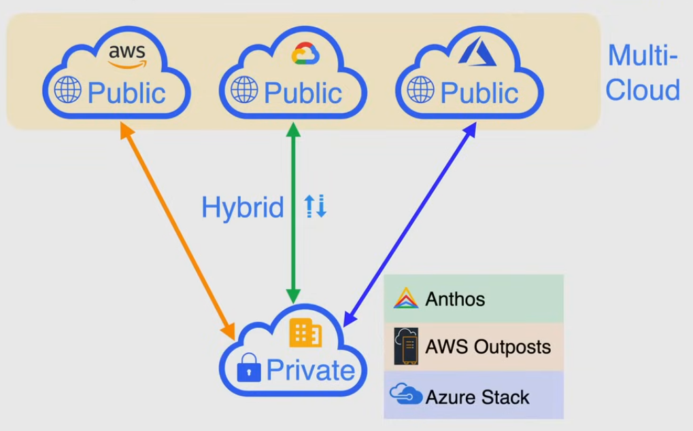
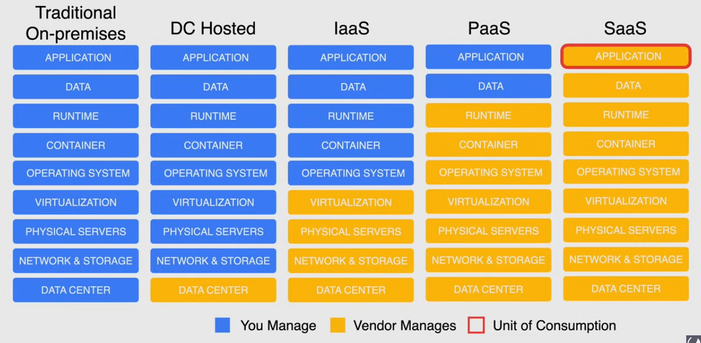

# Definition

The delivery of a shared pool of on-demand computing services over the public internet, that can be rapidly provisioned and released with minimal management effort or service provider interaction

## 5 characteristics of cloud

1. On-demand self-service -> provision resources automatically without requiring human interaction with the provider
2. Broad network access
3. Resource pooling -> support a multi-tenant model to allow multiple customers to share the same applications/physical infrastructure, while retaining privacy and security
4. Rapid elasticity -> rapidly provision/de-provision any of the cloud computing resources
5. Measured service -> monitored resource usage: `pay-per-use`

## Cloud deployment models

1. Public Cloud Model -> computing services offered by 3rd party providers over the public internet, es. Google Cloud, AWS, Azure
2. Multi-Cloud -> use of multiple Public Cloud providers, useful for disaster recovery and avoid Vendor lock-in. 
    > [!IMPORTANT]
    > Cannot use at full capacity one cloud provider capabilities

3. Private Cloud -> private architecture that exists on-premise with no public access, **MUST follow the 5 rules of cloud**, es Google Anthos, AWS Outposts, Azure Stack.
4. Hybrid Cloud -> Public + Private cloud used as a single system
    > [!IMPORTANT]
    > If my on-premise structure is connected to public cloud it is NOT automatically "Hybrid cloud", but `Hybrid Environment/Network`
    > True Hybrid Cloud allows to use the same tooling between private and public cloud, so my on-premise **MUST follow the 5 rules of cloud**

## Cloud service models

Referred to as **XaaS** -> Anything as a service

Application deployed on an *Infrastructure Stack*

### Traditional on-premise stack

Everything is managed by the user: high complexity, but flexibility

> [!TIP]
> Pizza example: produce all ingredients, mix and cook at home

### Data Center hosted

Parts managed by user and vendor, priced by unit of consumption
The vendor only handles the Data Center -> the unit of consumption is the space in the rack
> [!TIP]
> Pizza example: buy all ingredients, mix and cook  at home

### IaaS: Infrastructure as a Service

All layers until Virtualization is managed by vendor
Unit of consumption: Operating System
> [!TIP]
> Pizza example: pick up the pizza, cook it at home

### PaaS: Platform as a Service

Provider provides a computing platform containing OS, container, runtime.
Unit of consumption: Runtime

es. google app engine
> [!TIP]
> Pizza example: pizza delivered to your door

### SaaS: Software as a Service

All layers taken care by the vendor, user provided with application access and platform
Unit of consumption: Application
No flexibility, but less complexity
es. Gsuite, Microsoft office

> [!TIP]
> Pizza example: dining in the restourant

