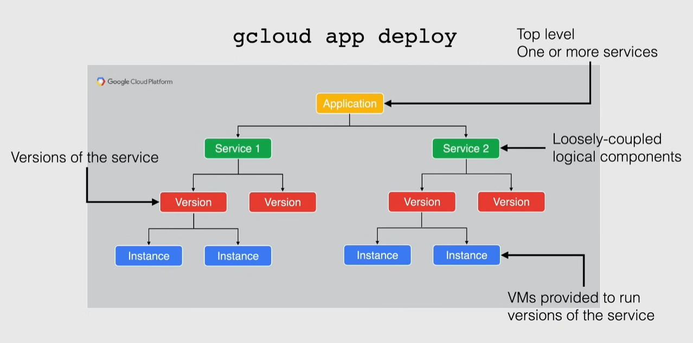

# App engine

PaaS -> Platform as a Service

Managed serverless platform to develop and host web apps

- launch code or containers
- autoscaled based on load
- track app versions to allow rollbacks, migrating, testing, traffic splitting
  - allow blue-green deployments
- supports connecting to external storage

> [!IMPORTANT]
> App engine _Region_ setting is IMMUTABLE. This means that once an app is created in a region, it cannot be moved to another region. The solution is to create a new app in the desired region and migrate the code and data.

## App engine environments

### Standard environment

- apps run in a sandbox environment
- specific versions of runtime used
- run for free or at a very low cost
  - can scale to 0 instances if not used
  - pricing based on instance hours
- designed for sudden and extreme spikes of traffic

### Flexible environment

- apps run in docker containers
  - docker containers run in compute engine VMs
- no free quota available
- designed for consistent traffic
- pricing based on VM resource
- managed VMs
  - health checks
  - automatic updates
  - automatic restarts
  - ssh and root access available

## Deploying an application

`gcloud app deploy` -> automatically builds a container image from a configuration file `app.yaml` using `cloud build`

App engine application

- defined in an `app.yaml` file
  - specify scaling type
- 1 or more services
  - each service can have different runtimes/settings
  - behave like loosely-coupled microservices
- each service has multiple versions
  - only one runs
- each version runs on 1 or multiple instances(depending on load)

### Scaling type

Automatic scaling

- based on metrics like request rate and response latencies
- each instance has its own queue for incoming requests

Basic scaling

- creates instances when the app receives requests
  - when there are no requests instances are deleted
- keeps costs low, but increases latency

Manual scaling

- specify the # of instances

## Traffic handling

### Traffic migration

Moves traffic from an old version to a new one

- old instances are shut down immediately or gradually
  - gradual migration is not supported on app engine Flexible
  - immediate migration causes a spike in latency

### Traffic splitting

Specify a % of traffic distribution between different versions

- conduct AB testing between versions
- can select how to split traffic
  - http cookie
  - IP address
  - random

> [!IMPORTANT]
> An App engine Application cannot be deleted, just disabled

## Commands

`gcloud app deploy` -> deploy an app based on the `app.yaml` file
