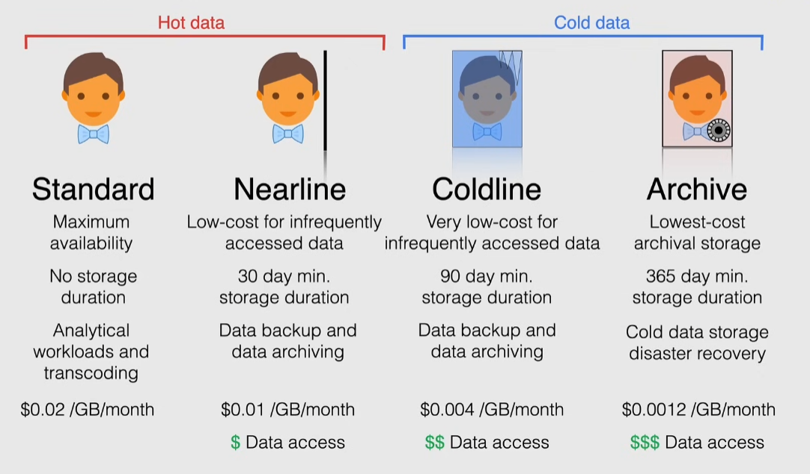

# Cloud storage storage types

Consistent, scalable, large-capacity, highly durable object storage

- not file or block storage
- worldwide accessibility and worldwide storage locations
- data files, text files, pictures, videos
  - useful for content delivery, big data sets and backups
  - stored as objects in buckets

## Cloud storage objects

Individual pieces of data stored in the bucket

- no limit on the # of objects in a bucket
- each object has 2 components:
  - data -> file data
  - metadata -> key-value pair
    - the object name is treated as a metadata

> [!IMPORTANT]
> A bucket has a flat namespace structure: there is no hierarchy between objects and they all live at the same level. For convenience, the console and gsutil use / characters as they were stored in a virtual hierarchy

## Bucket

Basic container that holds data

- organize data and control access
- cannot nest buckets
- has a global unique name -> every bucket resides in a unique cloud namespace

> [!IMPORTANT]
> Bucket name and regions can be changed only by deleting and re-creating the bucket

### Bucket location

Region

Dual-region

- geo-redundancy

Multi-region

- geo-redundancy

> [!IMPORTANT]
> Bucket location type can be changed only upwards. If it is dual-region it can be changed only to multi-region

### Bucket storage class

The storage class can be changed dynamically

Standard

- hot-data
- maximum availability
- no storage duration
- billing: GB stored

Nearline

- hot-data
- low-cost for infrequently accessed data
- 30 day minimum storage duration
- billing: GB stored + data access
- use case: continuously add files, but access them infrequently
  - ideal for backups and archives

Coldline

- cold-data
- very low cost
- 90 day minimum storage duration
- billing: GB stored + data access

Archive

- cold-data
- lowest-cost
- 365 day minimum storage duration
- billing: GB stored + data access

> [!NOTE]
> [Minimum storage duration](https://cloud.google.com/storage/pricing#early-delete): You can delete, replace, or move an object before it has been stored for the minimum duration, but at the time you delete, replace, or move the object, you are charged as if the object was stored for the minimum duration.

## Access control

4 options to choose from(and can be combined) for access control

1. IAM -> standard IAM permissions
2. Access Control Lists(ACL) -> define who has what type of access to the bucket and the objects
3. Signed URLs -> time-limited read/write access URL
   - allow unauthenticated users access the object for the duration specified
   - actions are taken as a user or service account
4. Signed Policy Documents -> specify what can be uploaded to a bucket

### IAM and ACLs

AIM -> Uniform access control

- recommended over ACLs
- 2 levels of granularity: project and bucket level
  - es. read all buckets but write only on one bucket
- roles available: primitive, standard, legacy
  - legacy roles are equivalent to ACLs

ACLs -> fine grained access control

- granular permissions: at bucket-level and per-object
- each ACL is 1 or more entries
  - entry = permission(action, object) + scope(who)
- Caution: ACLs overlap IAM roles

> [!NOTE]
> ACLs are a legacy access control system designed for interoperability with Amazon S3
