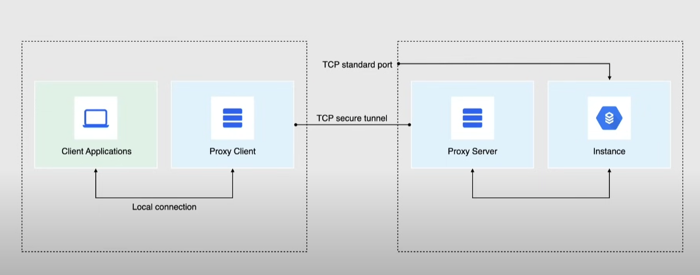
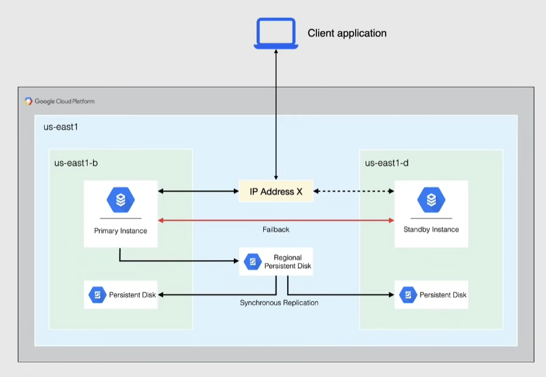

# Cloud SQL

DBaaS -> Database as a Service

Fully managed, relational database service (DBRMS)

- low latency, transactional, relational db workloads
- 3 flavors: MySQL, PostgreSQL, SQL Server
- offers replications with *Read Replicas*
- offers high availability
- On-demand and automatic backups
  - point in time recovery
- up to 30TB storage capacity per disk
  - automatic storage increase available
- encryption at rest and in transit offered
- billed for instance(CPU, memory), persistent disk and egress traffic

Cloud SQL instances(different from the Compute Engine ones):

- shared-core
- standard
- high memory
  - all marked by a `db-` in front of their name

## Connecting to Cloud SQL

### Public IP

- connections authorized only if they come from an **Authorized Network**
  - Authorized Network =  IP or IP range that the user has specified

Then you can connect to the service with external applications and other Google Cloud services

### Private IP

- recommended approach -> private IP more secure
- after configuring a private IP, it cannot be changed 
  - it is **best practice to use a private IP for databases** when possible
- all private IP connections go through a **cloud SQL proxy** -> authorize and secure connections using IAM

### Cloud SQL Proxy

- wraps the connection in a TLS layer
- recommended method to authenticate connections to Cloud SQL
- sits on the client and is distributed as an executable
  - port 3307

## Database replication

Use cases:

- scale the use of database without degrading performance
- migrating data between regions (planned)
- disaster recovery (unplanned)
  - promote a replica if the original instance becomes corrupted

Overview

- **Primary instance** -> instance that is replicated
- **Read replicas** -> read-only
  - exact copy of the primary instance -> updated in real-time
  - processes read requests, analytics
  - can have more CPU/memory than the primary instance, but not less
  - up to 10 replicas per primary instance

Types of replicas:

- in-region read replicas
- cross-region read replicas
- external read replicas -> external SQL instance
  - a SQL instance created on Compute Engine is considered an external read replica
- cloud sql replicas -> when replicating from an external server

Requirements for the primary instance:

- automatic backups enabled
- binary logging enabled -> enable point in time recovery
- one backup must have been created after binary logging was enabled

### Promoting replicas

- makes a read replica the new primary instance
- cannot be undone

> [!IMPORTANT]
> When promoting, the old read replicas will still refer to the old primary instance. Need to reconnect the other read replicas to the new primary instance

Use cases:

- when the primary database gets corrupted or is unreachable

## High Availability(HA)

- create a *cluster* that provides data redundancy
- a cloud SQL instance configured for HA is also called *Regional Instance*
  - located in 2 zones in the same region -> primary + secondary instance with a shared IP
  - primary disk replicated to the secondary disk
- billing: 2x price of a standalone instance

> [!NOTE]
> The standby instance does not fulfil read requests: != than read replicas

Requirements for HA:

- automatic backups enabled

Disaster recovery:

- if the primary instance becomes unresponsive the standby instance that becomes the primary
- when the primary instance starts again the traffic is redirected to it while the disks are being synchronized

## Backups

- by default, it backups data in 2 regions for redundancy
  - 1 in the same region as the instance, 1 in another
  - if possible backups are located in the same continent to comply with data residency regulations

Types of backups:

- On-demand
  - create at any time -> persist until deleted
- Automated
  - backup scheduled in a 4 hour backup window 
    - schedule backups when load is low
  - create one backup per day(by default) 
  - up to 7 most recent backups are retained(by default), up to 365

### Point in time recovery (PITR)

Important: to enable PITR, you must enable binary logging on the instance.

- recover an instance to a specific point in time
- always creates a new instance
- enabled by default

## AlloyDB for PostgreSQL

99.99% availability SLA

Better performance, scalability and availability than Cloud SQL for PostgreSQL.

- horizontal scaling with read pools
- built-in machine learning capabilities
- auto-tunes memory and query performance
- separates storage and compute

However, it is not a replacement for Cloud Spanner since:

- not globally distributed
- does not support horizontal writes