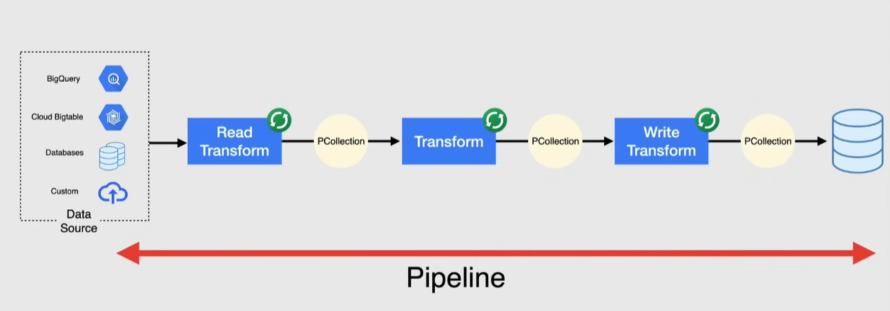
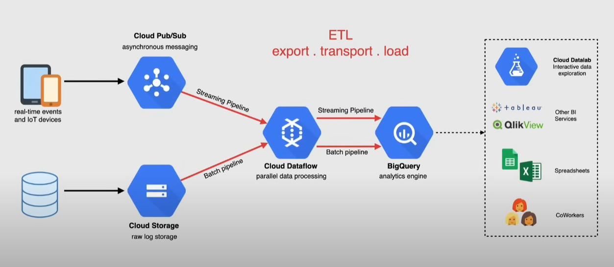
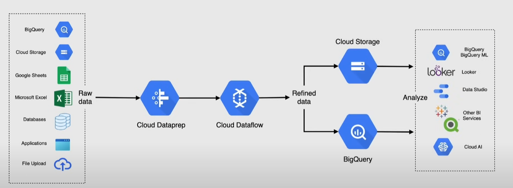

# Big Data Services

Characteristics of Big data in traditional databases

- massive amounts of data too expensive to store
- no flexibility to store unstructured data
- no support for realtime data
- lack support for Petabyte-scale data volumes

Solution: _Apache Hadoop_ and _NoSQL_ -> but are difficult to deploy, manage in on-premise environments

Big data use cases:

- make better decisions
  - increase revenue
  - get and retain customers
- use with machine learning

## BigQuery

Data warehouse for petabyte scale analysis with built-in machine learning capabilities

Use case: OLAP (Online Analytical Processing), real-time analytics

> [!NOTE]
> Traditional SQL databases are useful for OLTP (Online Transaction Processing) -> BigQuery is not a replacement for SQL databases

Compared to SQL, it is designed for **huge** datasets, like TB or PB of data.

Overview:

- supports SQL query language
  - saves all queries in a query history (limited to 6 months)
  - can save queries with name and description
  - can share a saved query with other users (note that the user must have access to the dataset)
- ingest data: streaming, bulk loading, batch ingest
  - also from outside Google Cloud
  - streaming provides real time analytics -> can use pub/sub and dataflow for streaming
- run queries on external sources: from Google Drive, Cloud Storage(_Object tables_), BigTable, Cloud SQL/Spanner
  - data does not need to be copied into BigQuery, but queries are slower (consider ingesting the data if speed is critical)
- automatic High Availability
- automatic backup and restore
- integration with Apache big data ecosystem
- IAM access control and data encryption
- billing: GB stored and queries
- query results
  - saved in temporary result tables (24h). Available only to the user that ran the query
  - can be saved in a permanent table --> can be shared with other users. Note that they incur in costs
  - can be downloaded as CSV or exported to Google Sheets
- Use views to simplify queries
  - but when using a view, GCP runs both the query and the view that is used in the
- access data:
  - web UI
  - `bq` CLI tool
  - apis

Data structured in multiple datasets, each dataset contains multiple tables.

- when creating a table, you can specify the schema or let BigQuery infer it

Data visualization:

- **Data/Looker Studio** --> serverless, scalable dashboards
  - can be accessed from BigQuery UI
  - creates SQL queries to fetch data from BigQuery
  - the dashboards created can be exported and shared
- **Connected Sheets** --> allows users to analyze BigQuery data in Google Sheets
  - available only for Enterprise customers

> [!IMPORTANT]
> Data is **immutable** in BigQuery, meaning that you cannot update or delete data in a table. You can only append new data to a table.

**BigQuery BI engine**: in-memory analysis accelerator built in BigQuery designed to give fast performance for dashboards and reports.

**INFORMATION_SCHEMA**: set of metadata views that provide information about BigQuery resources (datasets, tables, jobs...). Common use cases:

- troubleshooting errors in queries (e.g. quota exceeded error, failure reasons...)
- monitoring job history
- auditing -> track who ran what and when

## Pub/Sub

Real-time messaging service

- send and receive messages between applications
  - publish to a topic
  - messages held in a message queue
  - subscribe to a topic

Use cases:

- balancing large tasks
- distributing event notifications
- real-time data streaming

## Dataflow

**Serverless** processing service for executing `Apache Beam`(open source) pipelines for batch and real time data streaming

- Built-in fault tolerance and autoscaling
- Apache Beam SDK build a pipeline -> dataflow executes that pipeline taking care of all the low-level details
- billing: per-second pricing -> charged for when processing data

Pipeline:

- reads data from a source(e.g. Cloud Storage, Pub/Sub) -> generates a PCollection
- PCollection transformed
- writes transformed data(e.g. to BigQuery)

### ETL pipelines

Useful for ETL Pattern pipelines --> Extract, Transform, Load

Dataflow Job -> pipeline + other stages

Example:

## Composer

Workflow orchestration service built on open source `Apache Airflow`

- author, schedule and monitor workflows

Workflow: tasks for ingesting, transforming, analyzing, utilizing data

- DAGs -> collection of tasks that need to be run
- to run a workflow a specific environment is needed -> composer deploys it in GKE

For latency-critical workloads or when there are spikes in requests, use **Workflows** instead of Composer.

- serverless, fully managed service

## Dataproc

Managed cluster service for Spark and Hadoop. Gives full control over the environment, but without the need to manage the underlying infrastructure

- integrated with other Google Cloud services (BigQuery, Cloud Storage, BigTable)
- billing: 0.01$/vCPU/hour

Do not use it:

- Hadoop or Spark is overkill for simple ETL (Extract, Transform, Load)
- real-time processing (use Dataflow or Pub/Sub)
- you need serverless and autoscaling (use Dataflow, Cloud Run, BigQuery)

## Cloud Datalab

Interactive tool to explore, analyze, visualize and create machine learning models from data

- runs on compute engine instance inside a container
- uses jupyter notebooks

## Cloud Dataprep

Serverless for visually exploring, clearing and preparing structured/unstructured data for analysis

- detects schemas, data types, possible joins and anomalies

## Cloud Data Fusion

Code-free and code-friendly service for building and managing ETL pipelines.

Allows to build data pipelines visually or with code from multiple data sources or sinks.

## Data Catalog

Metadata management service that allows to manage and discover data assets at scale.

Use cases:

- manage metadata for assets in BigQuery, Pub/Sub, Cloud Storage...
  - e.g. find all tables with column `customer_id` in all BigQuery datasets in all projects in an organization
- improve compliance with _sensitivity labels_ and _access controls_

Now part of **Dataplex**: GCP unified data management platform.
