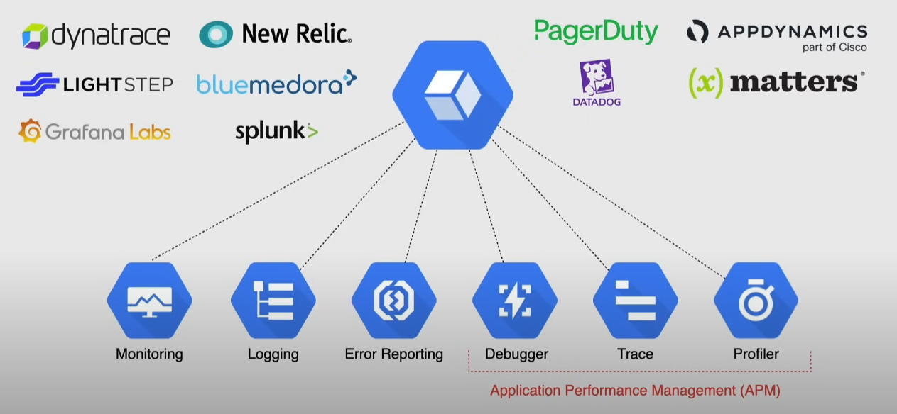

# Operations suite

Formerly known as `Stackdriver`

Suite of tools for logging, monitoring and app diagnostics

- available for GCP and AWS(connect to AWS with an AWS role and GCP service account)
- monitor VMs with agents
- available for on-premises and hybrid environments
- can integrate with other technologies

## Services

### Monitoring

Collects metrics to understand how apps are performing

- displays data through predefined dashboards
  - can create custom dashboards
- workspaces are needed to use cloud monitoring -> best practice to use a multi-project workspace to monitor all from one place
- agents are recommended to monitor VMs to gain detailed metrics
- works together with _Cloud Logging_
- support to monitor GKE
- define alert policies to receive notifications (email, sms, 3rd party tools)
  - up to 500 policies per workspace
  - 3 conditions for a policy: metric + behavior + period of time

#### Ingesting custom metrics

Custom metrics allow sending application data to Google Cloud Monitoring.

Note that the service account/user needs `roles/monitoring.metricWriter`.

Use cases

- Track custom business KPIs (e.g., transactions per second)
- Monitor application errors or warnings from logs.

### Cloud Logging

Central repository for log data from multiple sources

- logging can come from other environments other than GCP
- tight integration with Cloud Monitoring
- logs can be exported to other sources
  - archive storage
  - big query for analysis

Concepts:

- Log Viewer: shows logs associated to a GPC project
- Log Entry: record a status or an event
- Logs: named collection of log entries within a GCP resource
- Retention Period: how long logs are kep

Types of logs:

- **Audit/Activity Logs** -> who did what, where and when
  - Admin Activity Logs – record API calls that modify resources (e.g., gcloud compute instances delete, IAM changes).
  - Data Access Logs – record API calls that read data or metadata (e.g., reading from Cloud Storage or BigQuery).
  - System Event Logs – Google Cloud–generated entries about system actions (e.g., autoscaling, system maintenance).
  - Policy Denied Logs – track requests that were denied due to policy violations (like Org Policy or IAM Deny).
- Access Transparency Logs -> actions taken by Google Staff
  - es. when google staff accesses data for a support ticket
- Agent Logs -> logs from agents in VMs

Logs can routed/exported to a _Log Sink_, common log sinks are:

- Cloud Storage buckets
  - It can be upgraded to use _Log Analytics_ in order to run BigQuery-style-SQL queries without having to export logs to BigQuery.
- Cloud Logging buckets --> different from Cloud Storage buckets, they are optimized for logs
- BigQuery datasets
- Pub/Sub topics

#### Cloud Ops Agent

**Cloud Ops Agent = Monitoring Agent + Logging Agent**

Google Cloud's logging agent for VMs. It replaces the older _Monitoring Agent_ and _Logging Agent_ by combining both functions.

Collects metrics and logs from your VM and sends them to Cloud Monitoring and Cloud Logging.

#### OS Config Agent

Enables os patch management, policy enforcement, inventory management, and vulnerability scanning for VMs.

Used in conjunction with the OS config API.

### Cloud Monitoring vs Cloud Logging

| Aspect                    | Cloud Monitoring                                                           | Cloud Logging                                                                             |
| ------------------------- | -------------------------------------------------------------------------- | ----------------------------------------------------------------------------------------- |
| **Purpose**               | Tracks and visualizes **metrics** and system/application health over time. | Collects, stores, and analyzes **log entries** from your applications and infrastructure. |
| **Data Type**             | Numerical **metrics** (e.g., CPU %, memory usage, request count).          | Textual **logs** (e.g., error logs, audit logs, app output).                              |
| **Data Storage**          | Metrics stored as time series data points with timestamps.                 | Logs stored as structured or unstructured entries with timestamps.                        |
| **How Data is Collected** | Through agents (Ops Agent), built-in integrations, or custom metrics API.  | Through agents, GCP service logging, or direct log writes.                                |
| **Alerting**              | Supports alert policies based on metrics.                                  | Alerting possible using log-based metrics derived from logs.                              |
| **Visualization**         | Dashboards with charts and time series graphs.                             | Log viewer with search, filters, and export capabilities.                                 |
| **Examples**              | CPU usage over time, request latency, VM uptime.                           | Application error logs, HTTP access logs, security audit logs.                            |

### Error Reporting

Real-time error monitoring and alerting

- counts, analyzes and aggregates all errors in GCP
- sends notifications

### Debugger

Debugs a running application without slowing it down

- captures and inspects call stack, local variables
  - takes a _snapshot_ of the app
- _Logpoints_ allow to inject logging into running services
- can be hooked into a remote Git repo(es. Github)
- can be installed also in non-GCP environments

### Trace

Understand how long it takes for an app to handle incoming requests(latancy)

### Profiler

Continuously gathers CPU, memory usage from apps

- discover patterns of resource consumption
- low-profile -> does not consume much resources
- needs a profiling agent to be installed

## Observability scopes

Observability scopes allow to ingest metrics from multiple projects into a single workspace.

Scopes can be of these types:

- Log scope
- Metrics scope
- Trace scope

Example: I have 10 projects to monitor. The best approach is to create a single workspace and use a metrics scope to ingest metrics from all 10 projects. Note that a workspace is a project-level resource, so it can only be created in a single project.
