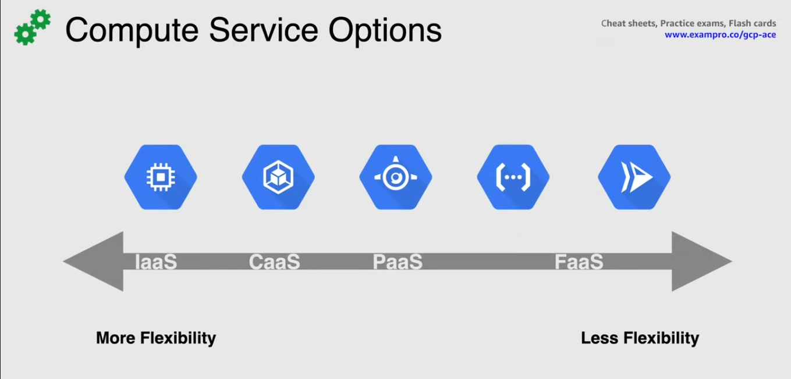

# Compute Service Options

## Compute Engine

IaaS = Infrastructure as a Service
Virtual Machines called `instances`

- choose Region and Zone
- choose OS
- create them using private or public images (also with pre-configured images from GC Marketplace)
- use ssh to connect

Manage multiple instances with `instance groups`:

- use autoscaling to scale
- attach disks as needed 
- can be used with Google Cloud Storage

## Google Kubernetes Engine (GKE)

CaaS = Container as a Service

Container orchestration system to deploy, scale, manage containers
Built on Kubernetes (open source, developer by Google)

- uses Compute Engine as nodes in the cluster(group of nodes)

## App Engine

PaaS = Platform as a Service

Managed serverless platform for hosting web apps at scale

- GC provisions servers and scales te app instances based on demand
- can connect to other GC services and databases (also connect with third-party services)
- integrates with Web Security Scanner to identify threats

## Cloud Functions

FaaS = Functions as a Service

Serverless Execution Environment for building and connecting Cloud services

- simple, single-purpose functions triggered by events produced by the infrastructure
- code executes in a fully managed environment -> no worries about the server

Written in `JS`, `Python`, `Go`, `Java`
Use cases:

- data processing
- webhooks to respond to http triggers
- lightweight APIs
- mobile backend functions

## Cloud Run

FaaS

Fully managed compute platform for deploying and scaling containerized apps
Built upon the standard `Knative`

- abstracts away all infrastructure management
- called `Serverless for containers`

