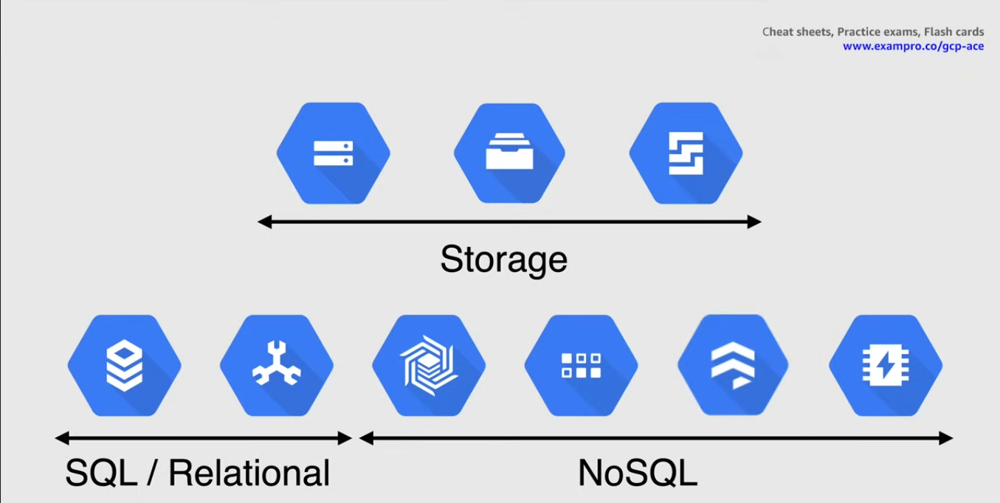

# Storage and Database

## Cloud Storage

Consistent, scalable, large-capacity object storage

- Object storage = manage data as objects
- durability with 11 9's -> 99.999999999%
- unlimited storage with no minimum object size
- use cases: content delivery, data lakes and backup

Available in different storage classes and availability

### Storage classes

#### Standard

Maximum availability, with no limitations

#### Nearline

Low-cost archival storage, used for low frequency accesses (< than 1 a month)

#### Coldline

Even lower cost, access frequency < 1 every quarter(qtr)

#### Archive

Even lower cost, access frequency < 1 every year
Backup use

### Availability

#### Region

Store data in 1 region

#### Dual-region

Store data in 2 regions

#### Multi-region

Store data between many different regions

## Filestore

Fully managed NFS server. Acts like a drive that VMs and GKE nodes can mount

NFSv3 compliant
Store data from running applications, VM instances and Kubernetes clusters

Allow multiple instances to access the same data, but **not the same file at the same time** (for that use Cloud Storage)

> [!IMPORTANT]
> Filestore is regional only, not global.

## Persistent Disks

Durable block storage: raw storage capacity 
Like a drive connected to an instance

Options available depending on Zone and Region

### Standard

Regular storage at a reasonable price

### Solid State (SSD)

Faster storage

## Database

### SQL/Relational

#### Cloud SQL

Managed db service in:

- PostgreSQL
- MySQL

#### Cloud Spanner

Scalable relational database
Support transactions, with strong consistency and high availability

### NoSQL

#### Bigtable

Managed, scalable db
High throughput with low latency
Cluster resizing without downtime

#### Datastore

Managed, fast, serverless db
NoSQL document database for mobile, web apps
Multi-region replication and ACID transactions

#### Firestore

NoSQL realtime db
Optimized for offline use
Cluster resizing without downtime

#### Memorystore

High-availability in-memory server for Redis and Memcached

