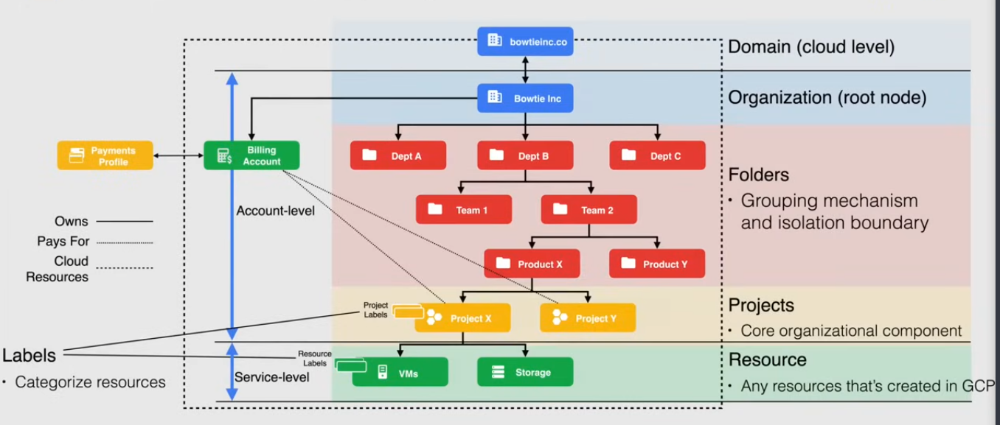

## What is a resource?

Configure and grant access to the various resources (service + account level)

Service-level resources

- Vms
- Cloud storage buckets
- SQL databases
- ...

Account-level resources

- [organization](#organization)
- [folders](#folders-layer)
- [projects](#projects)

## Resources structure

Organized in a tree structure -> map organizational structure to GC, better management of permissions and access

Policies controlled by IAM (Identity and Access Management)

- Policies on a parent resource are inherited by the child
- each child has only 1 parent

## Structure example



### Domain/Cloud level

Primary identity of organization

- manage users, policies, linked to gsuite and cloud identity accounts

### Organization

Root node of the GCP hierarchy, associated with ONE domain
Contains all the resources of the organization

NB: when an organization is created, an admin organization user is created

### Folders layer

Grouping mechanism and isolation boundary

Caveats:

- must have an organization node
- a folder can have exactly one parent

### Projects

Core organizational component of GC: projects are required to use service-level resources

Any resource can exist ONLY in 1 project, a resource cannot exist in more than one project

### Resource

Any service resource a project uses

**Labels**: can be assigned to projects/resources to help organize costs

## Structure operations

### Moving project between organizations

Prerequisites:

- Both organizations must be under the same Google Workspace or Cloud Identity domain.
- Have the roles:
  - on the project being moved: `roles/resourcemanager.projectMover` or owner
  - on the organizations: `roles/resourcemanager.organizationAdmin`

Run on the source organization:

```sh
gcloud beta projects move PROJECT_ID --organization=DESTINATION_ORG_ID
```
