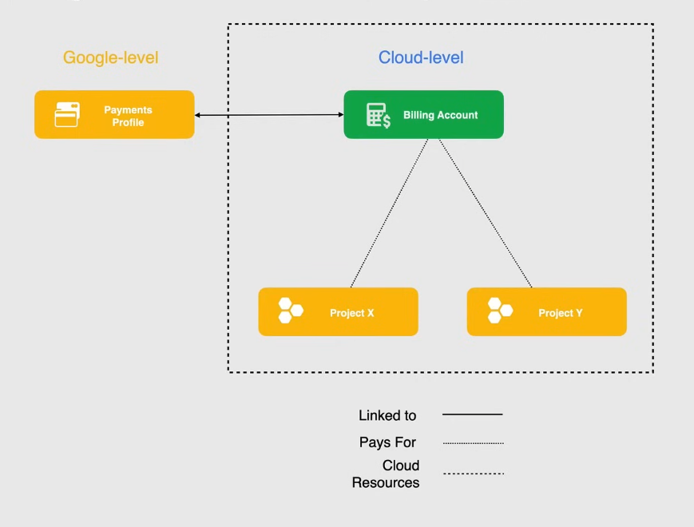

# Cloud billing

Cloud billing account: defines who pays for a given set of GC resources, tracks all costs incurred by GC usage

- linked to a payments profile
- linked to one or more projects
- can be controlled with specific roles/permissions established by IAM

## Billing account types

Self-service/online account

- payment: credit/debit card
- costs charged automatically to the payment method
- invoices can be viewed online

Invoiced/offline account

- must be eligible for this type of account
- invoices sent by email, available online

Sub-accounts

- intended for resellers
- group charges from customers to handle customer's payments -> customer separation
- linked to the master cloud account

> [!TIP]
> Billing account can pay for a project in a different organization
> Projects not linked to a Cloud Billing account cannot use GC services that are not free

## Payments profile

Google-level resources that processes payments for all Google payments(not only GC, es. Google Ads)
Stores your payment methods

Is a single view over your payments, controls who can view/receive invoices

### Individual profile

Only you can manage this profile

- cannot add people

### Business profile

Flexibility to add other users to the payment profile

> [!IMPORTANT]
> Once the profile type is selected, it cannot be changed!!

## Demo

1. ensure I have the right permissions to view, edit the billing account:
   1. IAM and admin > IAM
   2. Roles > view all roles' permissions
   3. e.g. Billing Account Administrator -> can manage an account, but cannot create other
   4. View my roles, if necessary update them
   5. Menu > Billing > Account management > Manage billing accounts

> [!IMPORTANT]
> A regular user needs the role Billing Account Administrator + Project Owner to change a billing account for a project

