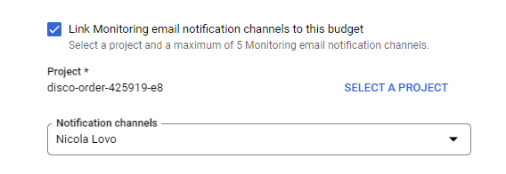

# Budget and alerts

## Committed use discounts (CUDs)

Discounted prices when you commit to using a minimum level of resources for a specified term

- 1 or 3 years commitment

Commitment types

- spend-based
- resource-based

Commitment fee is billed monthly

### Spend-based commitment

Discount for a commitment to spend a minimum amount of a service in a particular region

Any overage is charged at the on-demand rate

- 25% on 1 year
- 52% on 3 year

Available for:

- cloud SQL
- GC VMWare Engine
  But available only for CPU and memory usage

### Resource-based commitment

Discount for a commitment to spend a minimum amount of a Compute Engine in a particular region
Ideal for predictable workload
Purchase a contract for a single project or one shared between projects (enable **committed use discounts sharing**, maximizes all savings)

Available for:

- vCPU, GPU, Local SSD

Discounts:

- 57% for most resources
- 70% for memory-optimized machine types

### Sustained-use discounts

Automatic discounts for running Compute Engine resources for a significant portion of the month, up to 30%

Applies to vCPUs and memory for:

- general purpose machines
- compute optimized machines
- memory optimized machines
- gpus
- applies to vms created by GKE

> [!TIP]
> These discounts are applied automatically, no action needed

> [!IMPORTANT]
> Do not apply to App Engine flexible, Dataflow, E2 machine types and preemptable machines

## GCP Pricing Calculator

Quick estimate of what the architecture will cost

<https://cloud.google.com/products/calculator/>

## Budgets

Track actual spend against planned spends

Use budget alerts to stay informed about your spend if it exceed a threshold

- notifications sent to project and billing administrators
- recipients of this email can be customized (es. project manager)

> [!NOTE]
> A budget can be created for one/some/all projects and one/some/all services

### Scope of the budget

Define a budget for the whole account, or be more granular for each project/product

> [!TIP]
> Can use Pub/Sub for programmatic notifications or to automate cost management tasks
> 

## Demo

Compute engine > Committed-use discounts > Create commitment

> [!TIP]
> If it is the first time, enable Compute engine api

Billing > Budget and alerts

> [!TIP]
> The budget name does **NOT** need to be unique in the global environment

### Monitoring notifications channel

Need a Monitoring workspace -> handled later in the course

Monitoring > overview

- alerting > edit notification channels: can enable many different notification channels
- email > add new: now a new email channel has been added
- go back to billing > create budget > select the monitoring channel

### Reservations

Ensures that the reserved resources are always available for you

- sometimes the instances are not instantly available -> create a reservation to have that resource always available
- attach the resource to the commitment
