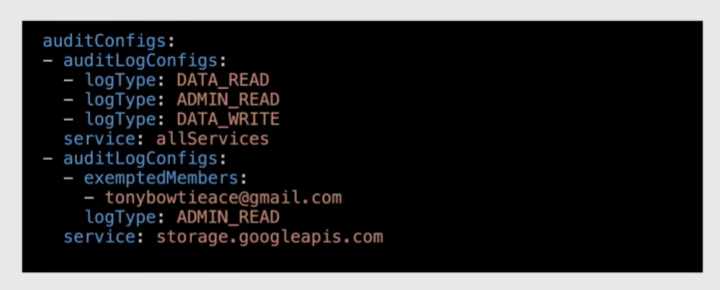

# Cloud IAM - Identity and Access Management

**Principle of least privilege**: a user/program/process should ave only the bare minimum privileges necessary to perform its function.

IAM:

- Who(identity)
- has what access(role)
  - permissions grouped in roles
  - roles granted to authenticated members
- for which resource

An IAM policy defines and enforces what roles are granted to each member: these policies are attached to resources.

## Policy architecture

Bindings + Metadata + Audit Config

### Binding

Binds one or more members to a role with a set on conditions that modify how the role is applied.

#### Member

Identity that can access a resource

- Google account -> an email address that is associated with a Google Account, including gmail.com or other domains
- service account -> account for an application
- Google group -> collection of google/service accounts, helps manage users at scale
- G Suite Domain -> google accounts that have been created in an organization's G Suite account (e.g. @mycompany.com)
- Cloud Identity Domain -> same as G Suite, but users don't have access to G Suite applications and features
- AllAuthenticatedUsers -> special identifier for anyone who is authenticated with a Google or service account
- AllUsers -> special identifier for anyone

#### Role

Named collection of permissions that grants a set of operations(not necessarily matching to REST methods) to a resource. Cannot directly grant a permission, but a Role.

Can create a custom Role by combining multiple permissions. Naming convention:

`${service}.${resource}.${verb}`

ex: `compute.instances.list`

3 types of roles:

- primitive -> legacy roles, avoid them
  - Owner
  - Editor
  - Viewer
- predefined -> give fine-grained access control. Created and maintained by Google
- custom -> are created per-project or per-organization
  - cannot create a role at a folder level
  - by default only owners can create new roles
  - do not support all permissions present in predefined roles
  - have a "Launch stage" to keep track of the availability of this role:
    - alpha: in testing
    - beta: tested and awaiting for approval
    - ga: generally available

#### Condition

Logic expression to define and enforce conditional attribute-based access control: grant access if specific conditions are met.

### Metadata

#### etag

Help prevent race conditions when multiple users want to update an IAM policy.

#### version

Used to avoid breaking current integrations when new features are released

Version 1(default):

- no condition statement
- supports binding one role to one or more members

Version 2:

- used for google internal use

Version 3:

- supports condition statement

### Audit Config

Determines which permission types/identities are logged.

IAM&Admin>Audit Logs

> [!IMPORTANT]
> Do not log everything, since logs can create a huge amount of data that is billed

**AuditConfig Logs**:

## Policy inheritance

Resources inherit policies of their parent.

Organization > Folder > Project > Resource

## Demo

IAM&Admin > IAM
