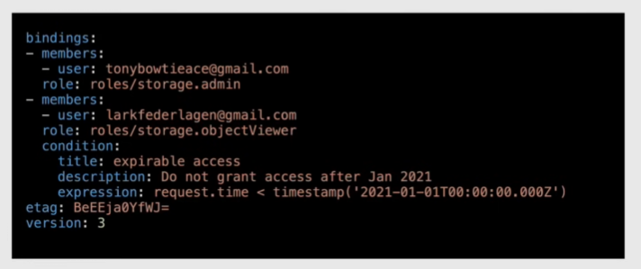

# Policies and conditions

Can be formatted in json or yaml

Example:



Query policies:

- `gcloud projects get-iam-policy ${projectId}` -> list policies attached to project
- `gcloud resource-manager folders get-iam-policy ${folderId}`
- `gcloud organizations get-iam-policy ${organizationId}`

**Policy limitations**

- 1 policy per resource (project, folder, organization)
- 1 policy can contain up to 1500 members of which at most 250 google groups
- up to 7 minutes to fully propagate IAM changes
- 100 conditional role bindings per policy
- 20 role bindings for same role and same member

## Conditions

Also called "Conditional Role Bindings": role bindings with a condition

Based on resource or request(timestamp, origin IP, geographic region...)

Examples:

- access only during work hours
- access to only a group of developers

Limitations:

- limited to specific services
- primitive/basic roles unsupported
- members cannot be allUsers or allAuthenticatedUsers

## Edit policy

Output the current policy to a file:

```sh
gcloud projects get-iam-policy ${projectId} > new-policy.yaml
```

Edit the file using the cloud editor.

Apply the new policy:

```sh
gcloud projects set-iam-policy ${projectId} new-policy.yaml
```

> [!IMPORTANT]
> When a policy is updated, the etag changes. Always edit the current policy with the **current** etag to prevent errors.

Add a role to user:

```sh
gcloud projects add-iam-policy-binding ${projectId} --member user:${email} --role ${role}
```
