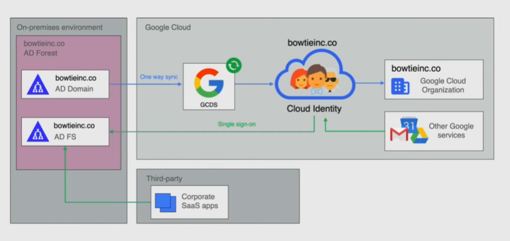

# Cloud identity

IDentity-as-a-Service(IDaaS) solution that centrally manages users and groups:

- provides SSO
- provides control over accounts used in the organization
  - user and group management
  - identity federation with `Active Directory` and `Azure Active Directory`
- device management
- security
- reporting
- Directory Management
- offers accounts with custom domains for the company email addresses, e.g. `@mycompany.com`.

How it works:

- create an account for each user and group
- use IAM to manage access to resources
- use Cloud Identity to federate identities with other identity providers like `Active Directory`

## Device Management

Lets people in any organization access organization data from mobile data while maintaining security. Employees can access data from wherever they are from their device.

Features:

- whitelist of approved apps
- push policies on the devices to protect organization data
- keep inventory of devices with organization data

## Security

- enforce 2-step verification
- manage passwords

## SSO

Access many apps without entering username and pwd each time. Use Google as an Identity Provider.

## Reporting

Audit logs for users, groups, devices...

Create reports from logs by exporting them to bigQuery.

## Directory Management

Handles profile information for users, groups, emails. Allows to share this data(profile info, calendar...) with other identity providers like `Active Directory`.

### Active Directory(AD)

Service developed by Microsoft used in most corporate on-premise environments:

- authenticates and authorizes computers and users in a windows-type network
- enforces security policies on every computer

**AD Forest**: hierarchical structure of AD
**AD Domain**: stores info about members of domain, verifies credentials and access rights

**AD Federation Service**(ADFS): SSO service that links a digital identity stored across multiple identity management systems -> subset of SSO since it handles only authentication

### Google Cloud Directory Sync(GCDS)

Free tool that syncs users data on Azure Active Directory with the cloud.

Synchronization is one-way: from Azure to GC so that Azure AD is the single source of truth.

Google services use ADFS to create a SSO experience.

## Google Workspace

Is a suite of productivity tools(gmail, drive, docs...) with identity management capabilities(IAM). Instead, Cloud Identity provides only identity management capabilities.

Google Workspace **includes** Cloud Identity(which also has a free version), which can be upgraded to Google Workspace if needed --> _identity federation_:

- every Google Workspace account is a Cloud Identity account
