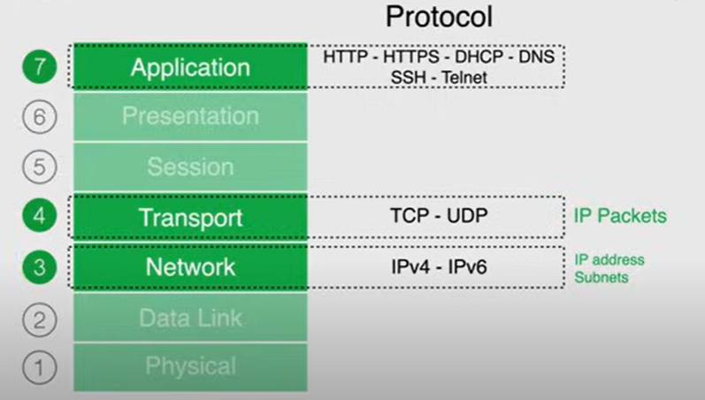
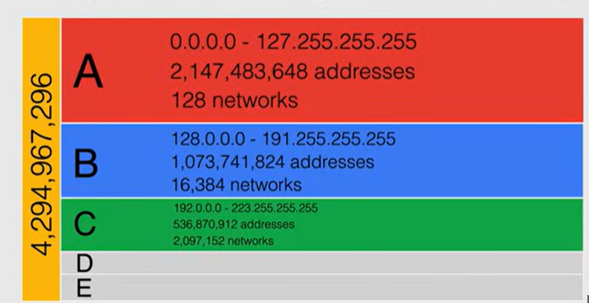
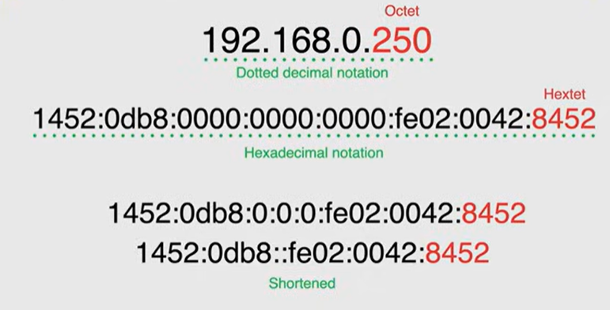
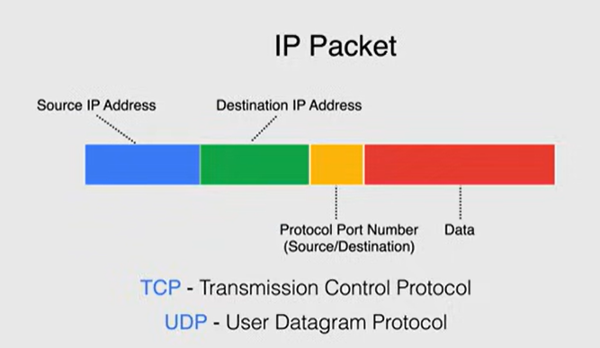

# Networking refresher

## Open Systems Interconnection (OSI) Model

The 7 layers of the OSI model are:

## Network layer

### Internet Protocol (IP)

#### IPv4

32-bit address space.

_Classful addressing_, 2 parts:

- Network part: identifies the network.
- Host part: identifies the host on the network.

#### CIDR

But this approach is inefficient, leading to the development of _Classless Inter-Domain Routing (CIDR)_. Representation of an IPv4 address in CIDR notation is `a.b.c.d/x`, where `x` is the number of bits used for the network part.

> [!NOTE]
> E.g. `178.192.68.263/23` means the first 24 bits are used for the network part, and the remaining 9 bits are used for the host part.
> So, the host addresses can be 2^9 = 512`

_Subnetting_ = the process of dividing a network into smaller, more manageable sub-networks (subnets). It allows for better organization and efficient use of IP addresses.

Private IP addresses are used for internal networks and are not routable on the public internet. They use Network Address Translation (NAT) protocol to communicate with the public internet.

Relevant IP addresses:

- /32 address: a single host.
  - useful for whitelisting a single IP address.
- `0.0.0.0/0`: all IP addresses (default route).

#### IPv6

128 bits

Each character represents 4 bits in hexadecimal notation, so 8 characters represent 32 bits.

Relevant IP addresses:

- `::/0`: all IP addresses (default route).

## Transport layer

TCP/UDP

## Application layer

DNS: port `53`
SSH: port `22`
HTTP: port `80`
HTTPS: port `443`
