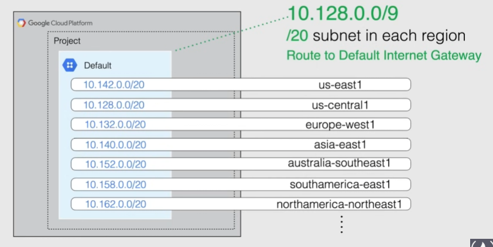

# Virtual Private Cloud(VPC)

Allows to create networks inside google cloud with private and public connectivity.

- Virtualized network within Google Cloud
- A VPC is a Global resource: not associated with a specific region/zone
- encapsulated within a project
- do not have any IP address ranges associated
  - IP ranges defined in the subnetworks
- Traffic can be controlled by firewalls
- resources within a VPC can communicate with one another by using internal(private) IPv4 addresses
- support ONLY IPv4 addresses, NOT IPv6
  - but it is possible to create an IPv6 address for a load balancer
- Each VPC contains a default network
  - a default network has a default firewall

2 VPC network types:

- Auto Mode
  - the default VPC is an Auto Mode VPC
  - has 1 subnet per region
  - set of predefined IP rages with /20 CIDR block(can be expanded to /8)
- Custom mode
  - does not automatically create subnets, provides full control
  - an Auto Mode VPC can be converted to Custom mode(not vice versa)
  - recommended in production

Each VPC has a default route to the internet at `0.0.0.0/0` with the next hop being the default internet gateway.

Note that you can create multiple subnets in the same region in a VPC, but they must not overlap in IP ranges.

Example:


> [!NOTE]
> VMs in the same network can communicate privately even if they are in different regions.
>
> If two VMs are in same region but different network, they need to communicate with external IPs(unless you use VPC peering or a VPN)

## Default VPC

New projects will start with their own Auto Mode VPC.



> [!NOTE]
> As Google creates new regions, they are automatically added to the default VPCs with an IP address

A custom subnet can be created in the default VPC by assigning an IP outside of `10.128.0.0/9`

## Demo

VPC Network tab

- `gcloud compute networks subnets describe ${network} --region=${region}` -> describe a network subnet
- `gcloud compute networks subnets expand-ip-range ${VPC_name} --region=${region} --prefix-length=${len}` --> expand the IP range of a subnet

## Deleting the VPC

> [!NOTE]
> Before deleting a VPC it is required to delete all resources inside it

## Creating a Default VPC

- subnet creation mode: Automatic
- check the firewall rules

## VPC Network subnets/sub-network

When creating a resource, we must attach it to a network and a subnet.

VPC Network = one or more subnets, each associated with a region.

- name and region of subnet cannot be changed after creation
- primary and secondary IP ranges of subnets cannot overlap with any allocated range

### Increase subnet IP space

Expand IP range of region by changing the subnet mask (x.x.x.x/yy). Caveats:

- must not overlap with other subnets
- must be inside the RFC1918 address-space
- network range must be larger than the original
- once expanded, cannot undo the modification

Auto mode network starts with a /20 range that can be expanded **up to /16, no more**

- to increase it even further, transform the auto mode network to a custom mode network

```sh
gcloud compute networks subnets expand-ip-range ${network} --region=${region} --prefix-length=${len}
```

Example: `gcloud compute networks subnets expand-ip-range default --region=us-west1 --prefix-length=16`

### Reserved IP addresses

Every subnet has 4 reserved IPs in its primary range:

- 1st address -> reserved for the network
- 2nd address -> default gateway(allows access to internet)
- second-to-last address -> google cloud
- last address -> broadcast

> [!NOTE]
> No reserved IPs in the secondary range
