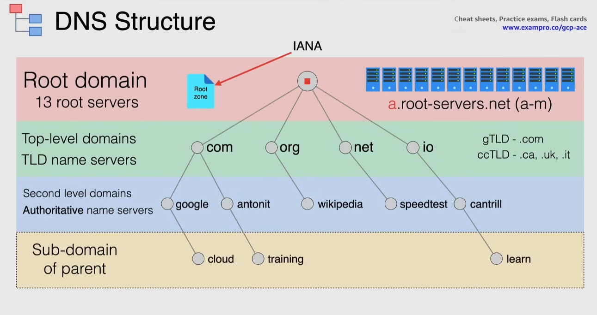

# DNS

## DNS fundamentals

DNS = Domain Name System

Global distributed database that stores IP addresses and other resources and lookup them by name:

- translates a name to an IP address

Note that the root of every domain is a dot `.`. For example, the root of `bowtieinc.co` is `bowtieinc.co.`. The browser automatically strips the dot when the domain is written in the search bar.

## DNS record types

Stored in "Zone files" within Name Servers(NS).

- NS (Name Server) -> identifies the Name Server that holds that domain
- A and AAAA records (Address records) -> associates a domain name to an IPv4 and IPv6 respectively
  - IPv4 = 32bit
  - IPv6 = 128bits = 32 \* 4 -> 4 letters A
  - can provide multiple A records for the same IP address
- CNAME (Canonical Name record) -> maps one domain name to another
  - cannot point directly to an IP
  - ex. `shop CNAME bowtieinc.co` -> `shop.bowtieinc.co` points to `bowtieinc.co`
- TXT -> provides text information for outside services
  - often used to verify domain ownership
- MX (Mail Exchange) -> direct emails to an email server
  - must always point to another domain
  - ex. `MX ${priority} ${domain name}` -> `MX 10 aspmx.l.google.com`
- PTR (Pointer record) -> opposite of A record: associates IP address to domain name
  - used in reverse DNS lookup (the user searches the IP instead of the domain name on the internet)
  - e.g. `195.92.54.52.in-addr.arpa PTR bowtieinc.co.`
  - Note that the IP address needs to end with `.in-addr.arpa` for IPv4 and `.ip6.arpa` for IPv6
- SOA (Start Of Authority record) -> created when you create your managed zone and specifies the authoritative informations
  - email of the admin, cache TTL...
  - every DNS zone register **must have one and only one** SOA record

**DNS Record Set** -> set of DNS records in a zone that have same name and type

- es. NS records that are usually found in pairs
