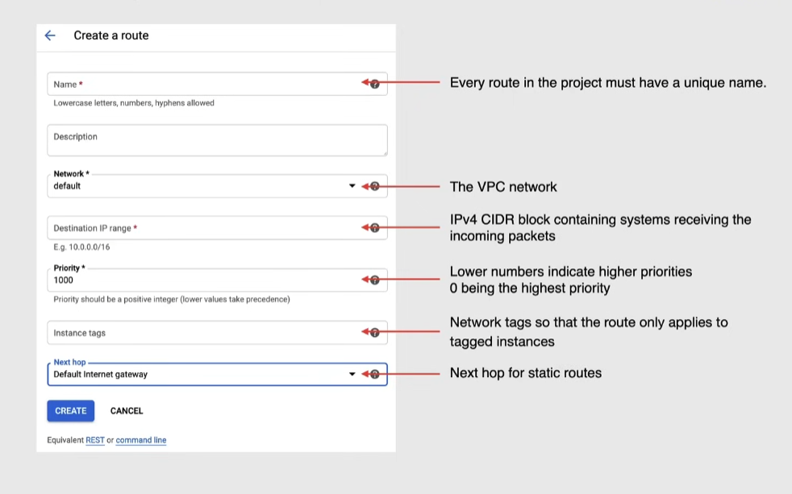
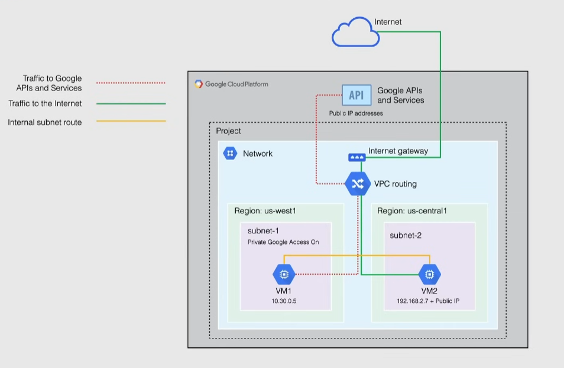

# Routing and private google access

## Routing

Defines the network traffic path from one destination to another, all routes are stored in the routing table for the VPC.

> [!NOTE]
> Routing table: stored in a router, stores routes to particular destinations
> In GC it is stored in the VPC

In a VPC it consists of a single destination(CIDR) and a single next hop.

When a VM in a VPC sends a packet, Google delivers the packet to the next hop of an applicable route based on a routing order

Routing types:

1. System-generated -> generated for each new network(Auto mode or Custom mode)
   1. Default route -> defines the path to internet(`0.0.0.0/0`) and a path for private google access
      - Can be deleted **only by replacing with a custom route**
      - has the lowest priority since it is the most general
   2. subnet routes -> define paths to each subnet
      - each subnet has at least one subnet route whose destination matches the primary IP range of the subnet
      - if the subnet has Secondary IP ranges, Google cloud will create a subnet route for each IP range
      - when a subnet is created, a corresponding subnet route is created for both primary and secondary IP range
      - no other route can be more specific than a subnet route
      - cannot delete a subnet route unless you modify/delete the subnet
2. Custom routes -> created on top of System-generated routes
   1. Static routes
      - can use the next hop feature. Types of next hop:
        1. default internet gateway for an external IP address
        2. instance -> to internal IP of the VM
        3. IP address -> provide an internal IP
        4. VPN tunnel
        5. TCP/IDP load balancers
      - created automatically when creating Cloud VPN tunnels
   2. Dynamic routes
      - Managed by one or more Cloud Routers
      - allows to dynamically exchange routes between a VPC and on-premise networks -> destination IP ranges are outside the VPC
      - used with dynamically routed VPNs and Interconnect

Static route parameters:

- if no tag is provided, the route applies to all instances

Routing order:

- subnet routes are always considered first -> more specific
- if no applicable destination is found, the packet is dropped
- system generated routes apply to all the VPC network
- custom static routes apply to all instances or only the ones with the selected tag

### Special routes/return paths

Used for certain services, defined outside the VPC in the Google production network. Cannot be modified or deleted, but can be used in custom routes.

Can control traffic to and from these services with firewall. These services can be:

- load balancers
- internet aware proxies
- cloud DNS

## Private Google Access

Only VMs with an internal IP address can use Private Google Access, this allows them to reach the external IP of Google APIs and services:

- requests to Google APIs stay within the Google network
  - VMs with only internal IP do not need Internet access for these requests
- VMs with an external IP can still access Google APIs, but not from a private access

