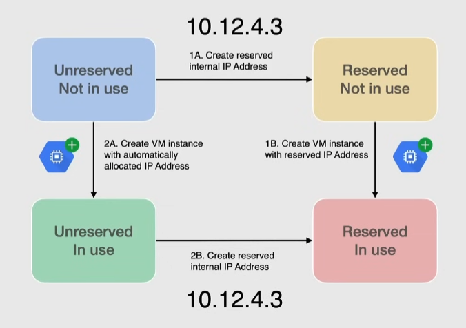

# IP addressing

## Internal(Private)

Not publically advertised, used only inside a network. Each VPC has at least one internal IP address range.

Resources with an internal IP communicate with each other privately:

- every VM can have 1 primary IP, unique in the VPC -> assigned when creating the VM, note that it must be in the range of the VPC
  - if not specified, one is assigned automatically 
  - If network is in Auto Mode -> address comes from region subnet (**Auto**)
  - If network is in Custom Mode -> address must be selected manually by choosing the subnet (**Custom**)

### Alias IP

- configure multiple internal IPs for a resource -> for example for each container in a VM without using a separate network interface
- can be assigned from the primary/secondary range of the subnet

### Ephemeral IP

- gets deleted when the resource is eliminated
- can be promoted to Static IP

### Static IP

- assigns the IP to your project until explicitly released(deleted)
- useful if you need to move an IP from a resource to another

## External(Public)

Needed to communicate with internet/resources on another network/a public Google Cloud service.

Sources outside a VPC can address a resource with its External IP as long as the firewall permits it.

### Ephemeral

- doesn't persist beyond the life of the resource
- for VMs, the IP is releases also if the VM is stopped
- can be promoted to static

### Static

- assigns the IP to your project until explicitly released(deleted)
- can be advertised on the internet
- can be a regional or global resource
  - regional IP address -> resources from that region can use that IP
  - global IP address -> can be used for global load balancers

## Internal IP address reservation

Assigning an internal IP, takes that address out of the automatic allocation pool since it is already assigned.

2 ways to handle an internal static IP:

1. reserve a specific address and then associate it with a resource
2. specify an ephemeral internal IP for a resource and then promote the address to static

## External IP address reservation

2 ways to handle an external static IP:

1. reserve a specific address and then associate it with a resource
2. specify an ephemeral external IP for a resource and then promote the address to static

