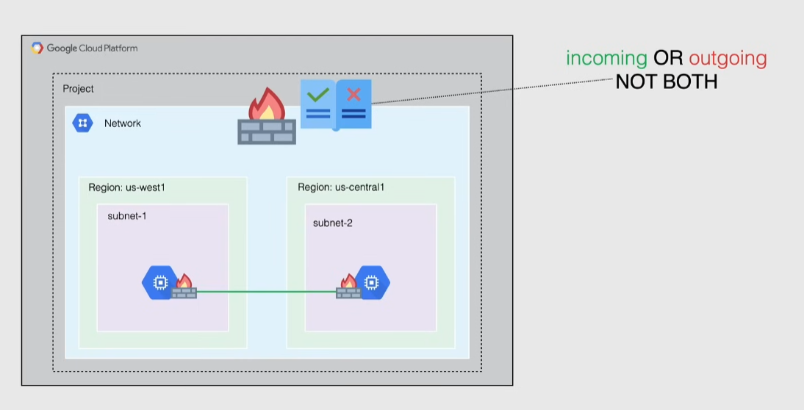
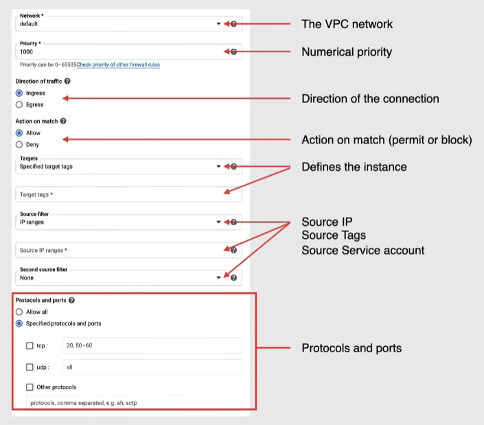

# Firewall

They apply to a project and a network.

- between instances, also in the same network
- between networks
- apply between the network and internet
  - but also between instances
- these rules are ALWAYS enforced

## Rules

A rule has a set of components:

- protocol
- ports
- sources
- destinations
- target -> optional, the instances the rule is applied to

### Default rules

The default VPC has a set of pre-defined rules, that can be modified if needed.

#### Pre-populated rules

- Google does not allow certain IP protocols:
  - egress traffic on TCP port 25
  - egress traffic with protocols other than TCP, UDP, ICMP, GRE to Google's metadata server (`169.254.169.254`)

**Google metadata server** -> provides basic functionality to the instance:

- DHCP
- DNS
- Instance Metadata
- NTP

#### Implied rules

They are pre-populated and have the lowest priority

- allow egress -> allow all IPs on egress
  - lets any instance send any traffic to any destination(except if blocked by other rules)
- deny ingress -> prevent all incoming connections

### Rules characteristics

- only support IPv4 connections
- filter ingoing **OR** outgoing internet traffic(not both)
- each rule result is either allow/deny
- must be attached to a **single** VPC network: cannot be shared among VPCs
- a rule is stateful: when a connection is allowed, also the return traffic associated with it is allowed
  - cannot deny response traffic
  - return traffic must match the 5-tuple\* of the accepted request, but with source and destination reversed
  - google cloud associates packets by using a connection tracking table

> [!NOTE] > _IP layer 5-tuple_: (source IP, destination IP, source Port, destination Port, Protocol)

> [!NOTE]
> A connection is considered in tracking if it sends at least 1 packet every 10 minutes

Rule form:

- a rule can be created in disabled state and enabled later
- note that in source filter/source IPv4 ranges to specify ALL IPs you can use `0.0.0.0/0`

**Target filter** determine to which resources the rule applies:

- all instances in the network
- instances with a specific tag
- instances with a specific service account

**Source filter** in case of an ingress rule:

- IPv4 or IPv6 ranges
- service accounts
- tags

**Destination filter** in case of an egress rule:

- IPv4 or IPv6 ranges

**In few words**:

- ingress rule --> "I(Target) am the Destination, I allow traffic from the Source only if it matches this rule"
- egress rule --> "I(Target) am the Source, I allow traffic to the Destination only if it matches this rule"
