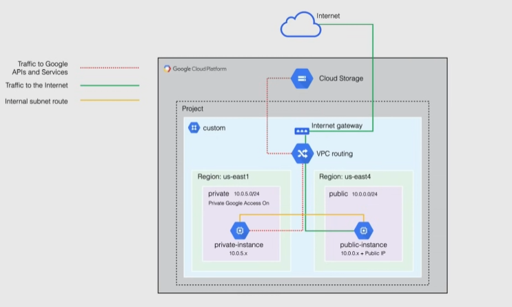

# Custom VPC Demo

- `gcloud compute ssh --project bowtieinc-446812 --zone us-east4-c private-instance --internal-ip` -> ssh into instance

- a VM with no external IP cannot access Google Storage or other google services, since they are outside of the VM's internal network
  - Need to enable "Private Google Access" on the subnet used by the VM