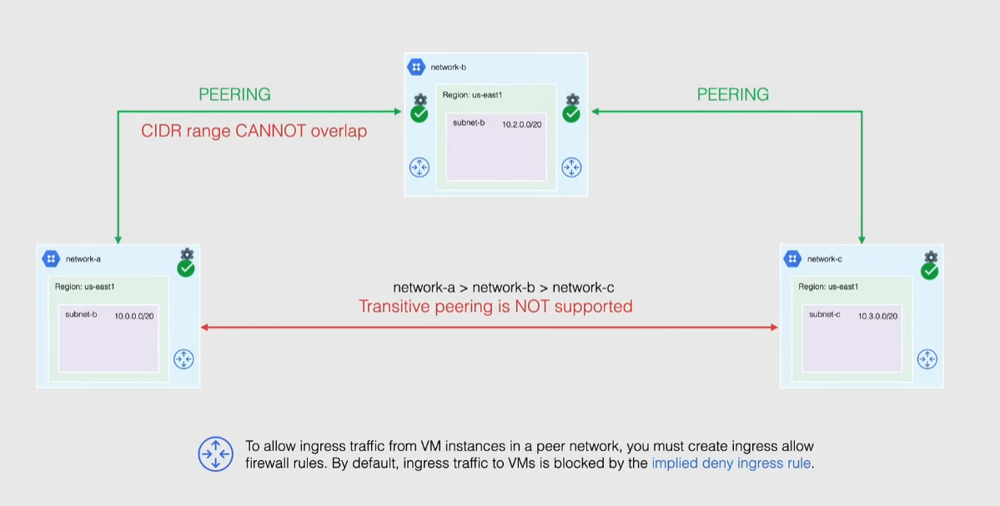
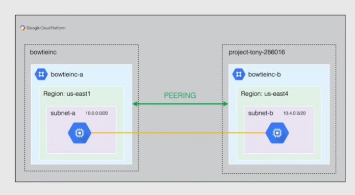

# VPC Network peering

Also called "VPC Peering"

By default, communicating between VPCs we should route through the public internet. The objective is to allow private connectivity across 2 VPC networks (following the RFC 1918 standard)

- traffic stays in Google network
- peer across VPCs in same or different projects/organizations
- reduces network latency -> stay in Google's network
- increased network security
- reduce network costs -> only traffic with public IPs is billed

Notes:

- each VPC remains administratively independent
  - different firewall rules, routes...
- peering becomes active when proper configuration from each side is done
- during peering the VPCs exchange all subnet routes, also custom routes could be exchanged

Restrictions:

- CIDR ranges cannot overlap between directly peered VPCs
- no overlapping subnet ranges between directly peered VPCs
- cannot directly filter which subnets of peered VPC are filtered: those have to be configured with firewall rules
  - by default ingress traffic in VMs is blocked by the *implied deny ingress rule*
- no transitive peering is allowed
- internal DNS is not accessible for compute engine in peered VPCs since it needs an IP to communicate

## Demo

VPC Network > VPC Network peering

- create a peering connection in BOTH VPCs bowtieinc-a and bowtieinc-b: if you create only one, the peering will not work