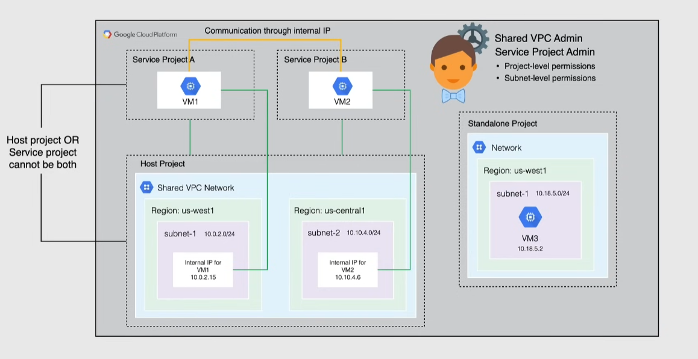
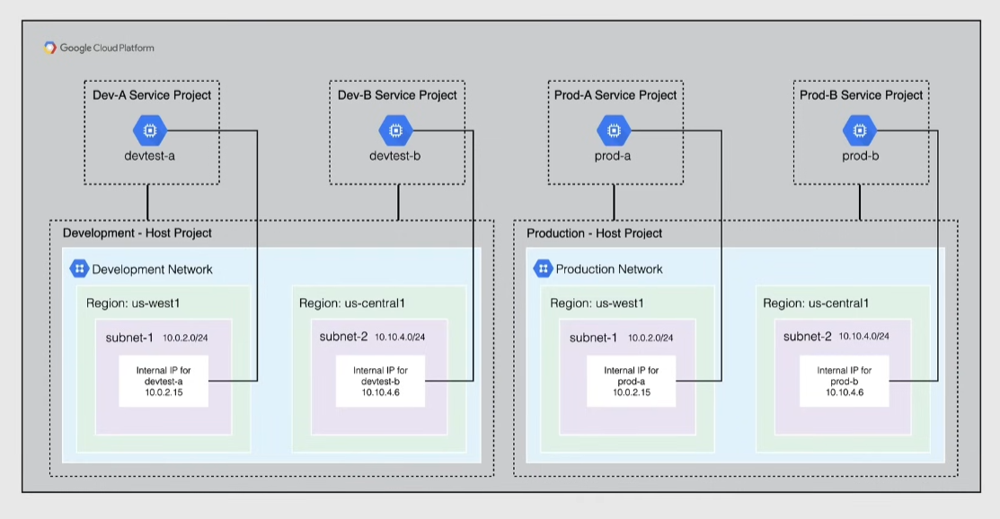
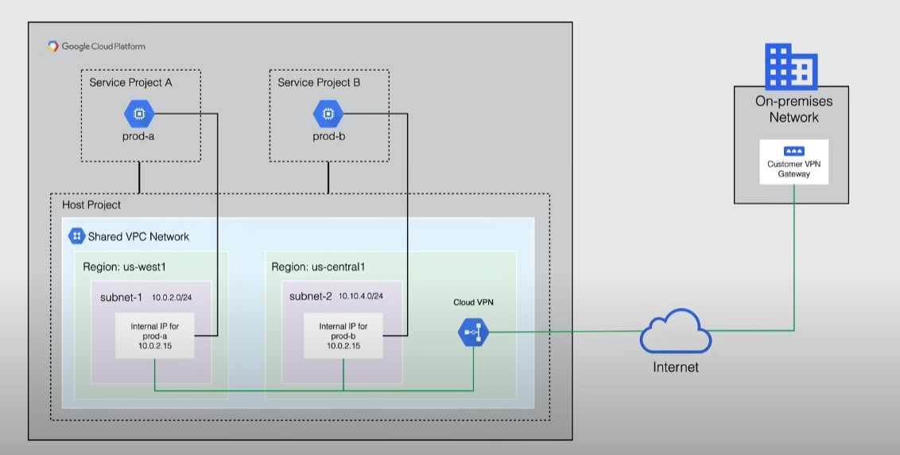
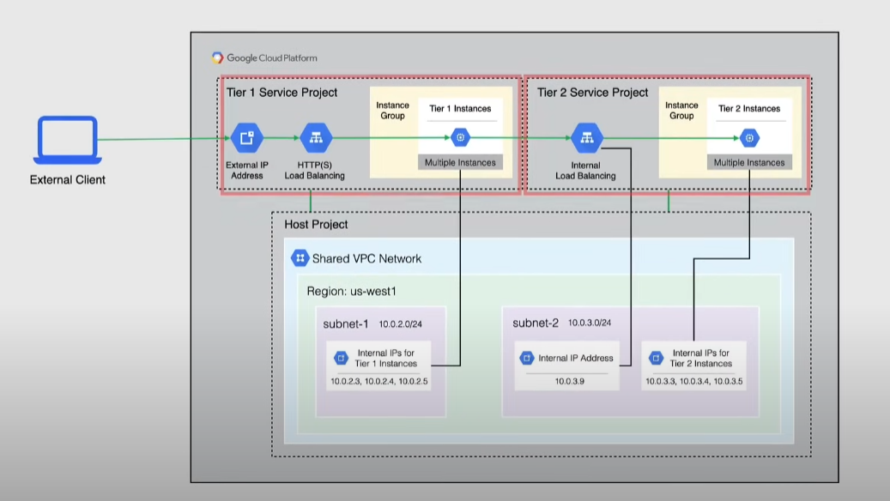

# Shared VPC

A normal VPC is tied to a project.

A shared VPC allow an organization to connect resources from different projects to a common network:

- a project is designated as *Host project* -> contains the shared VPC
- other projects are *Service projects*
  - each service project can be attached to a **single** host project
- a project that does not participate in any VPC is called *Standalone project*

> [!NOTE]
> A project cannot be *Host* and *Service* at the same time

Roles to manage a shared VPC:

- Shared VPC Admin -> enable host projects, attach service projects, delegate access to subnets
- Service Project Admin -> shared VPC admin for a Service project. Typically is also the project owner
  - Project-level permissions -> can use All subnets in the Host
  - Subnet-level permissions -> can use a limited set of subnets of the Host

Limitations:

- external IP addresses created in the Host project are usable only for resources in that project

## Use cases

- large organizations with multiple teams, projects
  - e.g. GKE clusters in one project, databases in another
- centralized network and security management
- isolation, but with collaboration between teams --> allow communication between projects

### Simple Shared VPC

### Multiple hosts

### Hybrid cloud

### Two-tier web service

