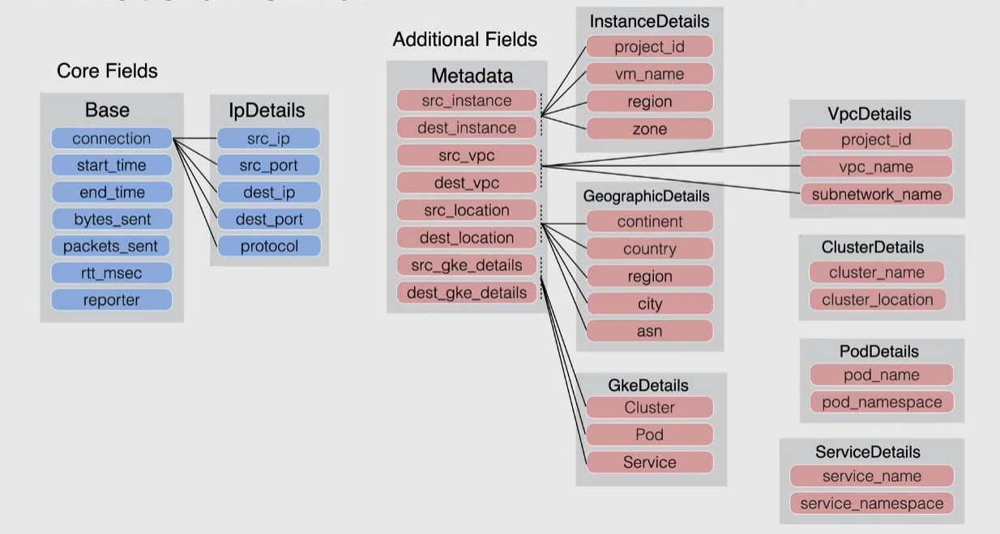

# VPC Flow logs

Records a sample of network flow sent from and received from instances in a VPC for monitoring.

> [!NOTE]
> Only a sample is recorded, about 1 in 10 packets. This cannot be changed

They can be enabled in a subnet-by-subnet basis(e.g. all instances in a subnet will have flow logs enabled).

Logs storage:

- can be exported to Cloud Logging(also known as Stackdriver) for 30 days
- then in Cloud Storage for long-term storage

Use cases:

- network monitoring -> real-time visibility of network throughput and performance
- analyze network usage and optimize network traffic expenses
- network forensics when incidents occur
- real-time security analysis
  - stream to Pub/Sub and integrate with a SIEM(=Security Information and Event Management system) for example Splunk/Rapid7/LogRhythm

## Record format

- metadata fields can be omitted to save costs
  - can hold information specific for GKE(Kubernetes)
