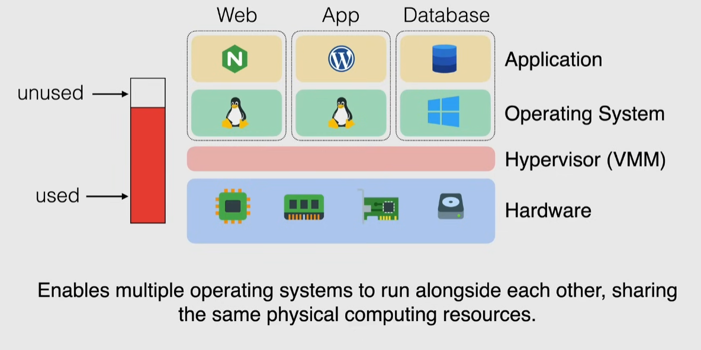
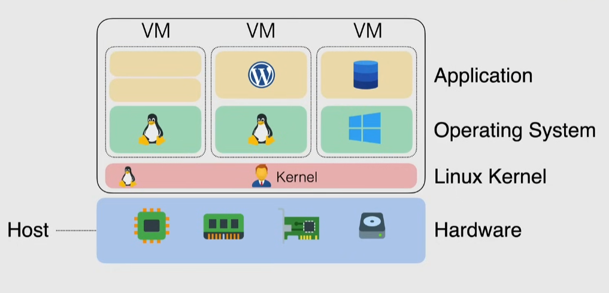

# Virtualization fundamentals

## Basic virtualization

- hypervisor prevents conflicts between VMs, but causes a performance penalty since all instructions need to pass through the hypervisor and translated

## Paravirtualization

The os is modified to talk directly to the hypervisor without translations

- hypercalls instead of system calls
- emulation overhead is removed

But machines still could not talk to hardware

## Hardware-assisted Virtualization

Hardware becomes "Virtualization aware"

Efficient, full virtualization using hardware capabilities

- guest OS can access directly hardware
- no need to modify the OS, since it is the hardware that is aware of the virtualization
- even more efficient

## Kernel Level virtualization

A linux kernel sees the different OSs as separate processes on the same host

- the kernel acts as the hypervisor
- every VM is a normal linux process
- hw support from CPU is required

Allows "Nested virtualization": install a hypervisor on the VM

This approach is used in Google Cloud:

- easy for users to move their on-premise infrastructure to the cloud
