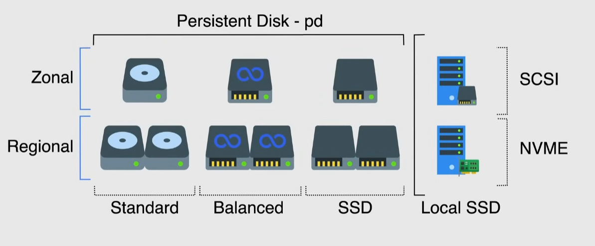

# Persistent disks and local SSDs

They are *block storage*

- by default each VM has a boot persistent disk
- when additional space is required you can add a persistent disk or a local ssd

## Persistent disks

Network storage devices, accessed as physical disks connected to the VM

- can persist after instance termination by checking the flag
- can be detached and moved to other instances
- can be resized while running
  - up to 64TB per disk
  - up to 128 persistent disks per VM
  - up to 257TB of total persistent disk space per VM
- encrypted by default

> [!NOTE]
> Shared code machines are limited to 16 persistent disks and 3TB of total persistent disk space per VM

3 types:

- standard or *pd-standard*
  - HDD
  - ideal for large data processing workloads with sequential I/O access
  - lowest price
- balanced or *pd-balanced*
  - SSDs that balance performance and costs
  - same maximum IOPS as *pd-ssd*, but lower IOPS per GP
  - ideal for general purpose use
  - up to 2x faster than *pd-standard*
- SSD or *pd-ssd*
  - fastest, but highest price
  - ideal for transactional databases, real-time performance
  - up to 5x faster than *pd-balanced*

2 geographic options:

- zonal -> disks available in 1 zone in 1 region
  - can be used with all machine types
  - used for workloads not sensible for specific zones outages
  - may be subjected to data loss in case of zonal outage
  - *use snapshots for high availability*
- regional
  - provide durable storage and data replication between 2 zones in the same region
  - slower than zonal due to replication 
  - can work with regional-managed instance groups
  - have a 250GB minimum size
  - **cannot** be used with memory-optimized and compute-optimized machine types

### Performance

Performance scales with the size of the disk and the vCPUs of the instance

- it takes CPU to perform I/O
- recommendation: 1vCPU per 2000-2500 IOPS of expected traffic

> [!NOTE]
> Performance scaling stops when it reaches either the limit of the disk or the limit of the vCPUS -> need to keep balance

> [!IMPORTANT]
> Size of a disk can be ONLY incremented, never decremented

## Local SSDs

Higher throughput and lower latency than persistent disks

- physically attached to the server
- ideal for caching

2 types:

- SCSI -> old protocol, has only 1 queue for commands
- NVME(Non-Volatile Memory Express) -> new protocol, designed for flash memory with up to 64000 queues
  - higher cost than SCSI
  - has the same throughput as SCSI, but much higher IOPS

Limitations:

- each SSD is 375GB
- can attach at most 24 SSDs
- data persists until instance is stopped or deleted
- can't use customer supplied keys to encrypt Local SSDs -> need to use Google's
- available only on N1, N2 and compute optimized machines
