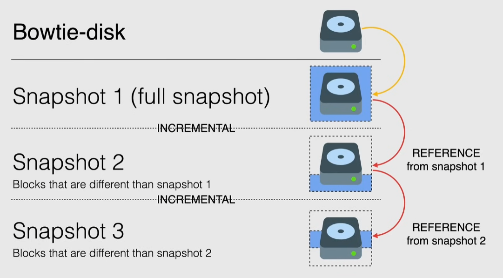

# Persistent disk snapshots

Backup and restore data of persistent disks

Global resources

- a backup can be accessed by any resource inside the same project, **can also be shared across projects**
- support zonal and regional Persistent Disks(PD)
- snapshots are incremental and automatically compressed
- stored in Cloud Storage in regional or multi-regional location
  - location of snapshot affects its availability and can incur in networking costs when creating/restoring it
  - if region is the same of the disk -> no network costs
  - by default the location is the multi-regional location closes to the disk
- a snapshot can be used to create a new disk from it

## Creating snapshots

- the 1st snapshot is a full snapshot
- (n)th snapshot holds only the differences with the (n-1)th
  - n >= 2

When a snapshot is deleted, if there are other snapshots that depend on it:

- any data required to restore the snapshot is moved to the next snapshot, increasing its size

> [!NOTE]
> If the disk has a snapshot schedule, you must before detach the schedule from the disk before deleting the snapshot.

### Scheduled snapshots

- best practice for backups
- must be in the same region as PD

2 ways:

- create the schedule and then attach it to the disk
- create the disk with the schedule

Define:

- retention policy -> how long keep the snapshots
  - can be set to keep a number of snapshots or a time period
- source disk deletion rule
  - controls what happens to snapshots if the disk is deleted

Limitations:

- a PD can have only one schedule attached at a time
- to **edit**/**delete** a schedule, first detach it from all disks
- at most 1 snapshot every 10 minutes

Best practices:

- eliminate excessive snapshots by creating an image from a snapshot and reusing it for the VM
  - reduce costs
- set schedule to off-peak hours
- for windows create VSS(Volume Shadow copy Service) snapshot 

### Using snapshots

Snapshots can be used as a base disk for a new VM. When selecting the OS I can choose a snapshot as the base disk.

## Demo

Create single snapshot:

- Compute Engine > disks > disk menu > create snapshot
- Compute Engine > snapshots
