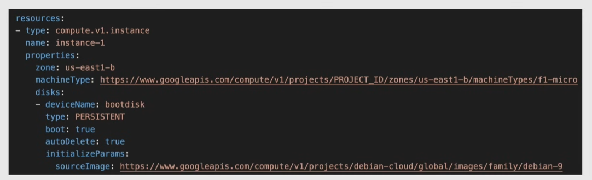

# Deployment manager

Infrastructure as Code tool: automate deployment of Google Cloud resources

Use yaml configuration

## Resources

The spec must contain a `resources` section. Each resource must contain:

- `name` -> user defined string
- `type`
  - base type: `${api}.${version}.${resource}`
  - composite type: `gcp-types/${provider}:${resource}` -> templates that expand to a set of base types when deployed (es. `gcp-types/compute-v1:addresses`)
- `properties`
  - parameters for the specific resource type

### Templates

Parts of configuration that have been abstracted as building blocks in separate files 

- imported and used as a type in a configuration
- can be written in Jinja(similar to yaml) or Python
- can define `template properties` -> variables passed through the "properties" of the resource that uses this template

## Deployment

Collection of resources that are deployed and managed together using a configuration

- deploy, update, delete resources by changing the configuration
- each deployment has a manifest -> read-only spec that describes the resources
  - based on the configuration file

Best practices:

- break configurations in separate logical units
- use references -> enforce order in resources created
  - by default all resources are created in parallel
- preview deployments using the `--preview` flag
- use Version Control to track deployment config changes
  - use CI/CD
- 