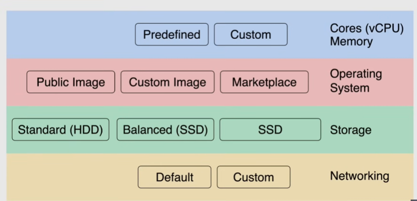

# Compute engine overview

Infrastructure as a Service (IaaS)

Multiple instance sizes and types:

- per second billing(after the first minute of activity) -> consumption-based billing
- launched in a VPC
- host is available in a Zone
- each instance is isolated from others
- can be run on a Sole-tenant node(a node dedicated only for yourself), but costs a lot
  - or on a Multi-tenant host

## Machine configuration

### Cores(vCPU) and memory

vCPU = single hardware hyper-thread on CPU

- predefined: choose from machine types
- custom: choose custom vCPU and memory amounts

> [!IMPORTANT]
> Network throughput is determined by the amounts of vCPUs:
> 
> *network throughput = 2Gbps * vCPU*
> 
> not determined by network interfaces or IP addresses

### Operating system

Operating system image:

- public images -> linux or windows
  - there are some premium images with additional costs
- custom image -> private images
  - can be created from snapshots(boot disks) or other images
  - add no cost when assigned to a VM, but storage for custom images is billed
- marketplace -> OS + software packages

Compute engine uses the provided image to create a persistent boot disk to boot the VM

- by default the disk size is the same size of the image

### Storage

- Standard HDD -> slowest and cheap
- Balanced SSD
- SSD -> fastest, but more expensive
- Local SSD -> SSD physically attached: highest throughput but highest cost
  - but data is removed when the machine is stopped or deleted -> suited only for temporary workloads

### Networking

Auto, default, custom networks

Load balancers distribute traffic

- regional/global load balancers

## Instance templates

Used in managed instance groups that define instance properties for when those instances are launched

