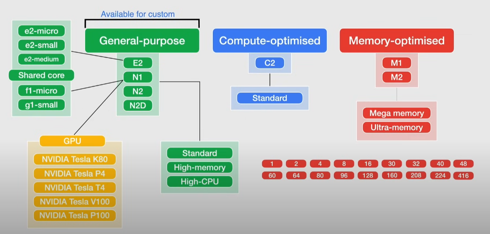
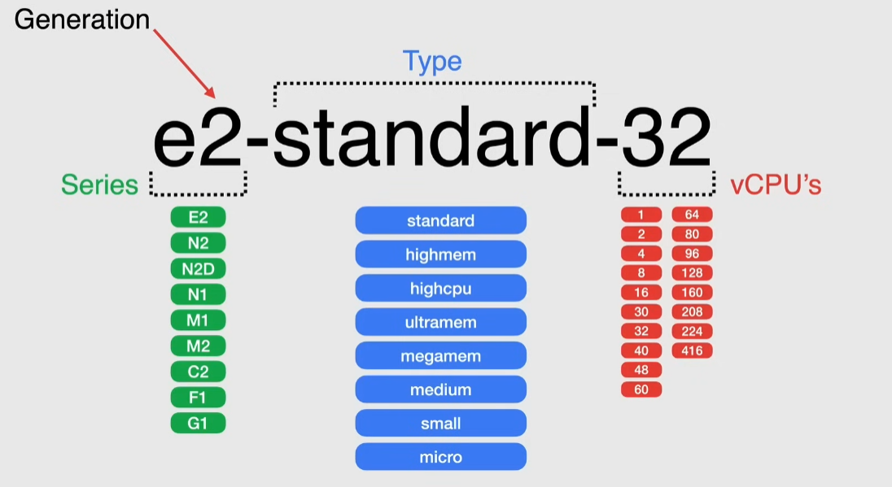

# Machine types

Grouped in families for different workloads

Machine type: set of virtualized resources

- vCPUs
- memory
- storage

## Machine type naming convention

`${series and generation}-${type}-${vCPUs}`

Example: `e2-standard-32`

- series: `e2`
  - generation: `2`
- type: `standard`
- vCPUs: `32`

## Families

### General purpose

3 types:

- standard
- high-cpu -> high cpu-to-memory ratio
- high-memory -> high memory-to-cpu ratio
- custom

Series:

- E2 -> low cost, day to day computing (web services, apps, dev environments...)
  - lowest price
  - no sustained use discounts
  - available for custom
- N-series -> balanced price/performance
  - N1 -> 1st generation
    - only machine that supports GPU and TPU support
    - larger sustained use discount than N2
  - N2 -> 2nd generation
    - higher clock frequency
    - higher per-thread performance
  - N2C
    - largest general-purpose machine
    - higher memory-to-core ratios

Shared core type:

- available for E2 and N1
- useful for burstable workloads, non-resource intensive apps
  - bursting happens automatically when more CPU than allocated is needed
- use context switching to share a physical core
- cost-effective

#### Custom

Specify vCPUs and memory within a limit.

> [!NOTE]
> It is more expensive than a predefined machine type

#### GPU

> [!NOTE]
> GPUs are available only for N1 series machines

### Compute optimized

Series:

- C2 -> compute intensive workloads
  - single-threaded applications
  - highest performance per core

> [!IMPORTANT]
> C2 machines cannot use regional persistent disks

### Memory optimized

Large in-memory databases and in-memory analytics.

Series:

- M1
- M2

> [!IMPORTANT]
> M1 machines cannot use regional persistent disks

## Spot VMs

Maximum runtime: 24 hours