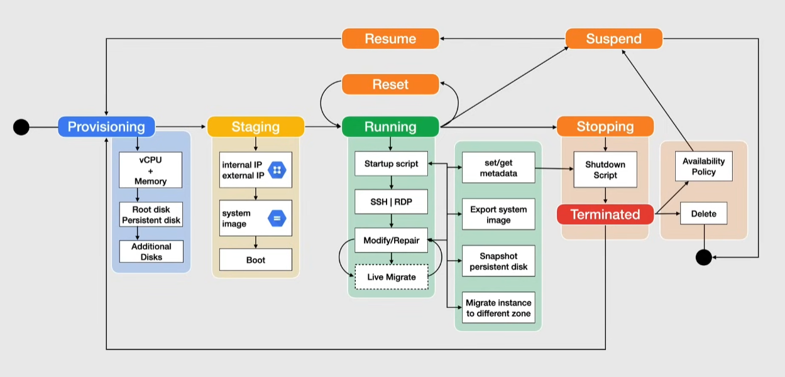

# Managing instances

## Instance Lifecycle

### Provisioning

Resources are allocated for the instance

- cost: None

### Staging

Prepares the first boot and boots up the instance

- cost: None
- allocates internal and external IPs
- prepares the system image

#### Shielded VMs

Option to add security: offers verifiable integrity of the instance -> verify the instance was not compromised

Shielded boot process:

- Secure boot -> verify signature for all boot components
- Virtual Trusted Platform Module(vTPM) -> enables measured boot
  - at the first boot, "Measure Boot" creates the *Integrity Policy Baseline* from these measures
  - each time after that, a new measure is taken and stored
- Integrity Monitoring -> relies on measures to enforce the *Integrity Policy Baseline*
  - checks suspect changes in the boot procedure compared to the first boot sequence

### Running

Startup script + run instance

- Cost: instance, static IPs and disks

From here it can transition to:

1. Reset -> wipe the memory contents and reset VM to initial state(persistent disks data retained). Hard reset -> the VM guest OS does not a graceful shutdown
2. Modify/Repair -> the instance is unusable, if it is still usable it will be running again
3. Suspend -> preserves the guest OS and memory contents. From this state the VM can be Resumed or Deleted
4. Stopping -> user requested a stop or there was a failure. Temporary status before terminating
    - Cost: resources attached to instance -> static IPs, disks
    - ephemeral external IPs are released

#### Startup script

A guest environment on the OS is installed

- using a custom image requires installing manually a guest environment that is available for Windows and Linux
  - the guest environment is built by Google or the owner of the OS

Components of guest environment:

- python package of scripts, daemons for linux
  - for Windows there is a binary package

> [!NOTE]
> A guest environment is a set of binaries, scripts, daemons that read the content of the Metadata server

Metadata Server:

- Compute Engine > Metadata
- provides a central point for serving metadata as a key/value pair for all instances
  - used in startup and shutdown scripts, as well as other usages
- metadata can be created at project or instance level
  - project metadata propagates to instances
- when requesting metadata, the request never leaves the physical host running the VM

#### SSH or RDP

VM access for Linux:

- SSH -> requires firewall Allow rule on `tcp:22`
  - Google recommends using OS Login(or 2SV) instead of SSH keys
    - OS login allows using IAM roles to manage instances -> links linux account to Google identity
    - if not possible, you can manage SSH key pairs

VM access for Windows:

- RDP(Remote Desktop Protocol) for windows
  - allow firewall rule `tcp:3389` 
    - if you want to access from powershell need to allow `tcp:5986`
  - requires setting Windows password -> set by console or gcloud CLI tool
  - login with [RDP chrome extension](https://chromewebstore.google.com/detail/chrome-remote-desktop/inomeogfingihgjfjlpeplalcfajhgai) or a 3rd party RDP client
  - Note that windows machines always come with an RDP client installed

> [!NOTE]
> A Windows machine comes with a preinstalled google cloud shell

#### Modify/Repair

Use cases: Google maintenance, migrate instance to a different zone in the same region

Can be done without shutting down the machine with *Live Migration*:

- `gcloud compute instances move ${sourceVM} --zone ${sourceZone} --destination-zone ${destZone}`
- keeps the instance running and keeps the whole instance state -> transparent to guest OS

> [!IMPORTANT]
> Instances with a GPU cannot be live migrated

### Terminated

Instance can be restarted or deleted

- Cost: resources attached to instance -> static IPs, disks
