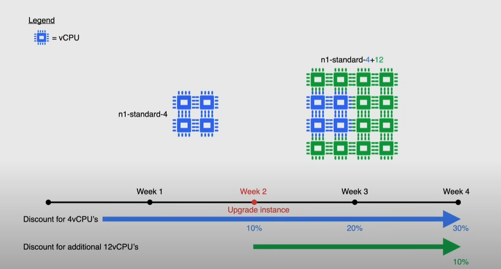

# Compute engine billing

- each vCPU and each GB of memory is **billed separately, rather than part of the same machine**
  - *resource-based billing*
  - all vCPUs, GPUs and GB of memory are charged by the second with a minimum of 1 minute
  - charged only for **instance uptime** -> # of seconds between you start an instance and you stop it

## Reservations

Ensuring the resources are available for when you need it:

- (default) automatically apply for instances that match the reservations properties
- reservation consumed by a specific instance

> [!IMPORTANT]
> A VM can use a reservations if its properties exactly match with the ones of the reservation

You start paying as soon as the reservation is created

- can have sustained use and committed use discounts

Have resources ready for:

- future increases
- unplanned spikes in hardware usage
- backup or disaster recovery

Limitations:

- available only for Compute Engine, Dataproc and GKE
- do not apply to shared-core VMs, preemptible VMs

## Discount types

### Sustained use

**Automatic** discounts for running specific resources a significant portion of the month:

- N2, N2D -> up to 20% discount
- N1 -> up to 30%

Do not apply to:

- E2
- AppEngine flexible environment
- Dataflow

Example:

- 50% of the month: N1-standard-4 
- 50% of the month: N1-standard-16

4 vCPUs used for 100% -> 30% discount
12 vCPUs used for 50% -> 10% discount

### Committed use

Purchase 1 year or 3 year contracts for deeply discounted prices:

- ideal for workloads with predictable needs
- up to 57% for most resources
  - up to 70% for memory-optimized machine types
- the contract applies at the project level,
  - a discount can be shared across multiple projects with the same billing account

Limitations:

- shared core machines excluded
- commitments can be purchased on a per-region basis
  - if a reservation is attached to the contract, **it can't be deleted**
- cannot be canceled after creation

### Preemptible VMs

Up to 80% cheaper, **fixed pricing**

- compute engine might stop or preempt these instances if it needs access to these resources
- they are always stopped after they run after 24 hours
- there is no charge if they run for less than 10 minutes
- might not be always available
- can't *Live migrate* or *Auto restart* when there is a maintenance event

Use cases:

- fault-tolerant apps
  - batch processing jobs
  - containers (for example in GKE)