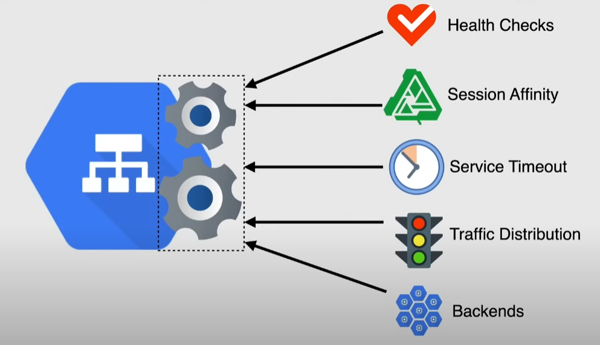
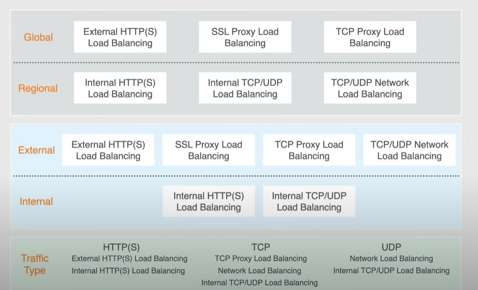

# Cloud Load Balancers

Load balancer: distributes user traffic across multiple instances

- single point of entry with multiple backends
- fully distributed and software defined -> no hardware involved, all done through software
- Global or Regional load balancer
  - should be as close as possible to users
- autoscaling with health checks

## Backend service

A load balancer knows how to distribute traffic by knowing the **Backend service** that is handling

Backend service configuration:

- traffic distribution:
  - balancing mode -> how the load balancer measures backend readiness
  - target capacity -> max # of connections/rate/CPU utilization
  - capacity scaler -> adjust available capacity without modifying the target capacity
- session affinity
  - requests from the same client will be routed to the same backend (if it has capacity)
- timeouts
  - time the load balancer waits for the service to return a response
- health checks
  - determines if the backend can receive new requests
- backends
  - group of endpoints that receive traffic

### Types of backends

- instance groups
- NEGs(Network Endpoint Groups)

> [!NOTE]
> A backend service can have an instance group OR an NEG: not both

#### NEGs

Configuration object that specifies a group of backend endpoints or services

Use cases:

- container services

## Load balancer categories

### Global vs Regional

- Global
  - backends distributed across multiple regions
  - can handle IPv6
- Regional
  - backends in a single region
  - cannot handle IPv6

### Internal vs External

- External
  - distribute traffic from internet to the internal network
  - must have **at least one backend service**
- Internal
  - distribute traffic within the network

### Traffic type

- HTTP(s)
- TCP
- UDP

## Global load balancers

### HTTP(S) Load balancer

Global, proxy-based, the **only layer 7 load balancer** behind a single external IP

- serve the application worldwide
- can be external and internal
- implemented on Google Front End(GFE) infrastructure
- can give support for HTTPS and SSL
  - need SSL certificates (Google Managed or self-managed)
- ports 80, 8080, 443(HTTPS)
- IPv4 and IPv6 traffic
  - IPv6 traffic terminates at the Load balancer and continues as IPv4
- distribute traffic by location or content
- URL maps -> backend services -> instance groups
- *Single Unicast IP* = Single external IP

Traffic management:

- cross-region load balancing
  - available for premium tier *External* type
  - uses a global external IP to route users requests to the backend in the closest region
- content-based load balancing
  - use url maps to select a backend service based on the requested hostname
    - es. /images -> images service; /video -> video service

> [!NOTE]
> This is the only Layer 7 load balancer in GCP, the others are Layer 4 load balancers.

Use cases:

- web apps
- rest APIs

### SSL Proxy load balancer

Layer 4 (TCP over SSL), optimized for encrypted non-HTTP traffic.

Reverse proxy load balancer that distributes SSL traffic from internet to VMs

Layer 4 load balancer

- client SSL sessions terminated at load balancer and proxied to the closest backend using SSL or TCP
  - premium tier it can be defined as a global load balancer
  - with standard tier it is a regional load balancer
- distributes traffic as location only
- Single Unicast IP
- **support for TCP with SSL offload** (important for exam)
- IPv4 and IPv6 support: same as HTTP load balancer
- can be used for other protocols that use SSL, like Websockets and IMAP over SSL 

Use cases:

- you want the LB to terminate SSL at the edge
  - e.g. need to inspect, log, or route based on decrypted data 
- apps using encyrpted TCP protocols --> **not** mongodb or redis, since their protocols cannot work after SSL termination
- secure TCP apps (e.g. banking, games)

**TIPO REDIS/MONGODB PROTOCOLS?**

### TCP Proxy load balancer

Layer 4 (plain TCP), for non-HTTP encrypted traffic.

Reverse proxy load balancer that distributes TCP traffic from internet to VMs

Layer 4 load balancer

- does not terminate SSL
- client and server handle the encryption (e.g. Redis with TLS)
- distributes traffic as location only
- Single Unicast IP
- intended for non-HTTP traffic
  - can use SSL for security by providing a certificate
  - supports many TCP ports (es. 25 -> SMTP)
- IPv4 and IPv6 support: same as HTTP load balancer
  - IPv6 traffic terminates at the Load balancer and continues as IPv4

Use cases:

- Legacy TCP apps that need global routing
- apps that use protocols that don't expect the connection to be decrypted by the load balancer
- expose Redis or MongoDB to the internet

### External application load balancer (envoy based)

Next-gen HTTP(S) load balancer based on **Envoy proxy**, global and regional modes, supports WebSockets, gRPC, HTTP/2.

> [!IMPORTANT]
> The traditional HTTP(S) load balancer is based on the Google Front End (GFE) infrastructure, while the external application load balancer is based on the Envoy proxy.
> Also, the traditional HTTP(S) load balancer does not (or has limited) support for websockets, gRPC, and HTTP/2.

Use cases:

- modern apps with WebSockets, microservices, gRPC

## Regional load balancers

### Internal HTTP(S) Load Balancer

Internal Layer 7 load balancer for GKE or microservices.

### Internal TCP/UDP Load Balancer

Layer 4 internal traffic load balancer

- accessible only internally
  - balances traffic across instances
- supports TCP or UDP, not both
- traffic automatically sent to the backend
- forwarding rules
  - can specify at least 1 up to 5 ports or `ALL` to forward traffic to all ports

Use cases:

- load balancing between VMs inside a VPC

### Network Load Balancer (External TCP/UDP)

Layer 4, external access to backend services

Use cases:

- low-latency, high-throughput applications (e.g. gaming, VoIP)

### Passthrough Network Load Balancer (Regional)

Pass-through load balancer that distributes TCP and UDP traffic to VMs in the same region

- *Direct server return*: it is not a proxy -> responses from the backend go directly to the client, not through the load balancer
- can be regional and external
- supports TCP or UDP, not both
  - no TLS offloading or proxying
  - can support self managed SSL certificates
- supports traffic not supported by TCP proxy and SSL proxy
- SSL decrypted by backends, not by load balancer
- traffic distributed by protocol, scheme and scope
- multiple forwarding rules reference only one target pool

Use cases:

- minimal overhead for TCP and UDP traffic

### Proxy Protocol Load Balancer

Preserves client IP information in L4 load balancing

Use cases:

- applications that need to know the original client IP address (e.g. security, logging)

## Choosing a load balancer

Consider 3 factors:

1. Protocol and layer:
   1. HTTP(S) --> HTTP(S) Load Balancer
   2. TCP/UDP --> TCP/UDP Proxy or network Load Balancer
   3. Internal traffic --> Internal LB
2. Traffic origin
   1. Internet --> External Load Balancer
   2. VPC-to-VPC or intra-cluter --> Internal Load Balancer
3. Geography
   1. Global routing --> Global Load Balancer
   2. Regional routing --> Regional Load Balancer

| Load Balancer                        | Layer | Scope             | Proxy | SSL Termination | Use Case                                                   |
|-------------------------------------|-------|--------------------|-------|------------------|-------------------------------------------------------------|
| **HTTP(S) Load Balancer (GFE)**     | L7    | Global             | Yes   | Yes              | Web apps, REST APIs, content-based routing                  |
| **External Application LB (Envoy)** | L7    | Global/Regional    | Yes   | Yes              | gRPC, WebSockets, microservices, modern apps                |
| **SSL Proxy Load Balancer**         | L4    | Global (Premium)   | Yes   | Yes              | Encrypted non-HTTP apps needing SSL offload (e.g., IMAPS)   |
| **TCP Proxy Load Balancer**         | L4    | Global (Premium)   | Yes   | No               | Redis, MongoDB, SMTP (custom TCP protocols with TLS)        |
| **Internal HTTP(S) LB**             | L7    | Regional (internal)| Yes   | Yes              | Internal GKE/microservices routing                          |
| **Internal TCP/UDP LB**             | L4    | Regional (internal)| No    | No               | Load balancing TCP/UDP between VMs inside a VPC             |
| **Network Load Balancer (External)**| L4    | Regional           | No    | No               | Gaming, VoIP, latency-sensitive apps                        |
| **Passthrough Network LB**          | L4    | Regional           | No    | No               | Minimal overhead TCP/UDP, Direct Server Return              |
| **Proxy Protocol LB**               | L4    | Regional/Global    | Yes   | Optional         | When backend needs original client IP                       |

## Network service tiers

Premium

- global load balancing available only in this tier
- traffic enters Google's backbone network at the closest point to the user
  - useful if apps span multiple continents

Standard

- uses the public internet for the most of the route
- regional-only resources
  - useful for internal-only or regional apps