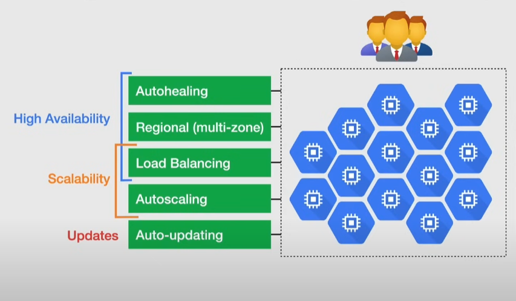

# Instance groups and instance templates

Setup a group of identical servers

- instance templates handle server properties to deploy instances in groups

## Instance group

Collection of VMs that can be managed as a single entity

2 types:

- `Managed Instance Groups(MIGs)` -> operate multiple identical VMs
  - autoscaling
  - auto-healing
  - regional deployments
  - auto-updating
- `Unmanaged Instance Groups(UIGs)` -> managed by the user

Use cases:

- stateless server workloads -> web servers, web apps...
- sateless batch workloads -> high performance workloads
- stateful workloads using `stateful MIGs` -> databases

> [!IMPORTANT]
> You cannot create a MIG without an instance template

### Features

#### Autohealing

Maintain high availability by keeping VMs in a running state:

- re-create instances that are not running
- application-based autohealing -> health checks
  - recreate VMs with unhealthy apps

Similar to load balancing health checks, with differences:

- load balancing does not direct traffic towards unhealthy VMs, it does not recreate the instance

#### Regional(multi-zone) deployment

Create Regional MIGs or Zonal MIGs

Regional MIGs:

- higher availability
- machines split across multiple zones in the same region
- at most 2000 machines (double than zonal MIGs)
- protects against zonal failure

#### Cloud Load Balancing

An instance group is a type of backend that can be connected to a load balancer

- does not direct traffic towards unhealthy VMs

#### Autoscaling

Dynamically add/remove instances to the MIG:

- use an autoscaling policy to specify how the group should scale up and down
  - based on CPU usage, load balance capacity and cloud monitoring metrics

#### Auto-updating

Deploy new versions of software to instances:

- update deployment based on specification
- perform rolling updates -> zero downtime
- perform partial rollouts for canary testing -> reduce risk and validate new software
  - `staged rollouts`

### Cost optimization

- use preemptible VMs
  - if an instace is deleted the autohealing will bring it back when there is capacity
- can deploy container images with a container-optimized **OS that includes docker**

### Unmanaged instance groups

Can contain instances of different types and sizes: can add/remove instances as you like

But they do not offer:

- autoscaling
- auto-healing
- regional deployments
- rollout support
- instance templates

Special use cases when mixed instance types are needed

## Instance templates

Resource used to create VM instances and MIGs

Global resource

- can be restricted to a zone by using zone-specific resources

Define:

- machine type
- boot disk image
- container image
- labels

> [!NOTE]
> Creating an instance template has no costs

Can create MIGs or VMs from an instance template

Notes:

- an instance template cannot be updated or changed after creation
  - to change it, create a new instance template based on the previous template or a VM
- can use private or public images for the instance template