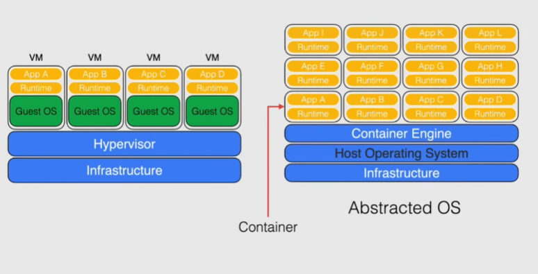

# Introduction to containers

## Virtual machines vs containers

VMs:

- large overhead
- each VM has to run the whole OS
- no standardization -> each guest is different, not portable

Containers:

- standardization
- host OS on top of hardware
- container engine instead of hypervisor
  - the container shares the host kernel
  - operates independently running its app and the dependencies needed -> little overhead

## Container registry

Place to store and manage docker images

Docker host: any machine running docker