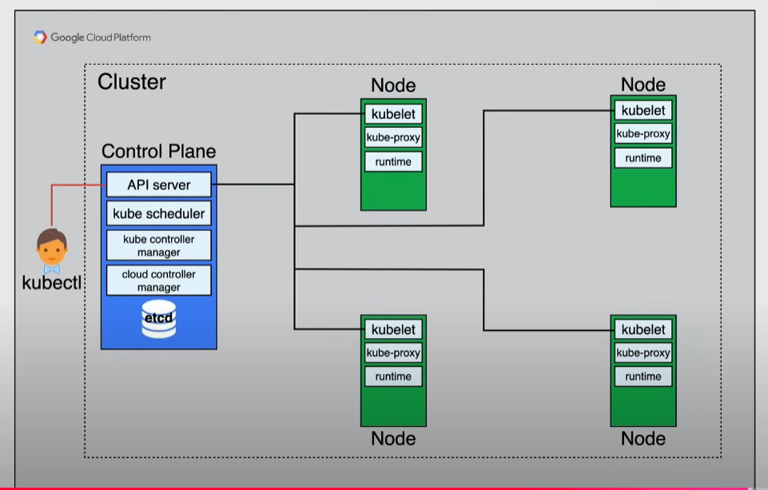

# Google Kubernetes Engine (GKE)

Managed kubernetes offering on Google infrastructure: compute engine instances that form a cluster

- abstracts complexity of hardware
- offers advanced cluster management features:
  - cloud load balancing
  - node pools
  - autoscaling
  - automatic updates
  - node auto-repair
  - logging and monitoring

Cluster architecture:

- 1 or more Control Planes
- 1 or more Nodes

## Control Plane

- schedules, manages the whole cluster:
  - handles network, storage
  - makes sure the cluster is in the desired state
- is the unified endpoint of the user

### Control Plane Components

#### API server

Called with `kubectl`, HTTP or gRPC

- detects, responds to cluster events
- all interactions with the cluster are done with api calls

#### Kube scheduler

Discovers and assigns new pods to a node

#### Kube controller manager

Runs control processes

- responds when nodes go down
- maintains the correct number of pods
- creates default accounts and API access tokens
- takes action on the cluster when it does not meet the desired state

#### Cloud controller manager

Embeds cloud-specific logic by linking the cluster to the cloud provider's API

#### ETCD

Stores the state of the cluster:

- key-value store that only interacts with the API server
- stores configurations, what nodes are part of the cluster and what pods are running

## Nodes

- run containerized apps
- responsible for Docker runtime 

### Components

#### kubelet

Agent that communicates with the control plane

- starts, runs docker containers on Pods

#### kube-proxy

Maintains network connectivity between pods and cluster

#### Container runtime

Like `docker` and `containerd`

## GKE abstraction

GKE manages:

- all control plane components
- exposes kubernetes API server -> used by `kubectl`
  - exposes the cluster IP
- automates the kubernetes nodes by launching them as Compute Engine VMs
- automates software updates

