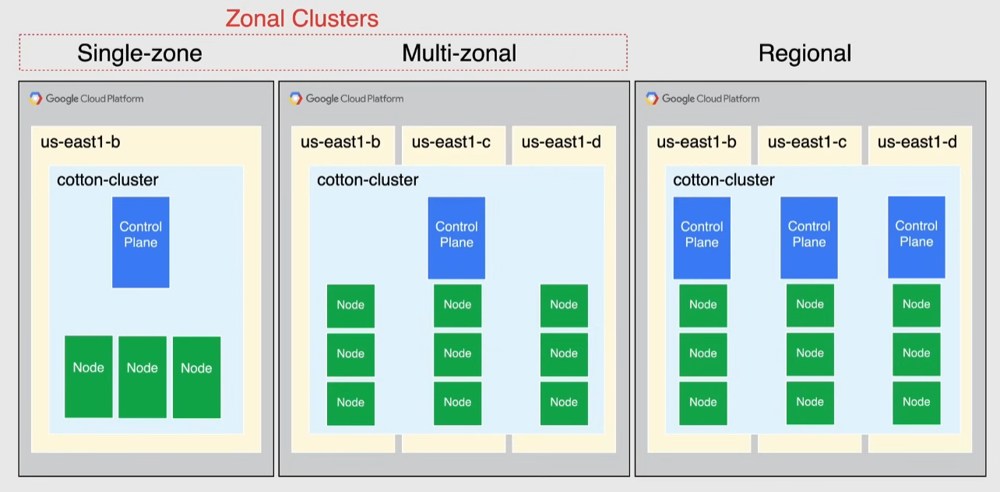

# Cluster management

## Node pools

Group of nodes that all have the same configuration

- contains 1 or multiple nodes
  - you can't change the configuration of just 1 node in the pool: all must have the same configuration
- when creating a cluster the # and type of nodes becomes the default node pool
- custom node pools are useful for pods that require more resources
- all new node pools run the latest version of kubernetes
  - existing node pools can be manually/automatically upgraded

_Node Auto-repair_: automatically repairs nodes that are unhealthy or experience degraded performance.
_Node Auto-upgrade_: automatically upgrades nodes to the latest version of kubernetes.

## Cluster types

### Zonal vs Regional

#### Zonal Clusters

Single-zone

- single control plane in a single zone

Multi-zonal

- single replica of the control plane in a single zone
  - if there is an outage in the zone where the control plane is placed, workloads in other zones will still run, but they won't be configurable until the control plane is available
- nodes in multiple zones
- balance availability and cost
- the same number of nodes will be deployed in each zone -> may increase costs

#### Regional Clusters

- one replica of the control plane for each zone
- consumes more resources
- the same number of nodes will be deployed in each zone -> may increase costs
- by default spans over 3 zones

### Private vs Public

#### Private cluster

- isolate nodes from having inbound/outbound connectivity to public internet
  - internal IPs only
- use a NAT to provide internet access
- by default private google access is enabled -> can access only google APIs
- the control plane VPC is connected to the nodes VPC with VPC peering
  - the control plane network is located in a project controlled by google
  - the nodes network is located in the user's project
- the control plane has:
  - a private endpoint -> internal IP in the control plane VPC
  - a public endpoint -> external IP: access can be controlled using authorized networks or access can be disabled

#### Non-private cluster

- the control plane has just a public endpoint

### Cluster version

Recommended to enable auto-upgrade(enabled by default) and choose a **Release Channel** to select when to install a new kubernetes version:

- rapid -> latest kubernetes release as early as possible
- regular(default) -> 2-3 months after release in rapid
- stable -> 2-3 months after release in regular

Or select a **Specific Version** for specific needs

- and perform a Manual upgrade, but cannot upgrade Control Plane more than one minor version at a time

Control Plane upgrade:

- Control Plane and Nodes do not necessarily run the same version at all times
  - control plane is always upgraded before the nodes
- in a zonal cluster you cannot launch/edit workloads during upgrade
- in a regional cluster each control plane is upgraded one by one

Nodes upgrade:

- one node at a time is upgraded
- when a node is being upgraded, GKE stops scheduling pods on it
  - the node is then re-created with the same name as the old one -> only now the node is schedulable
- upgrade is completed when:
  - all nodes have been recreated
  - cluster is in the desired state
- upgrading a node pool may disrupt workloads
  - to prevent it, create a new pool with the new version, migrate the workload and delete the old one

> [!NOTE]
> When upgrading you can choose maintenance windows and exclusions for when to perform the upgrade

#### Surge upgrades

- control the number of nodes GKE can upgrade at a time
  - reduce disruption in workload
- behavior determined by 2 settings:
  - `max-surge-upgrade` -> # of additional nodes that can be added to the pool during an upgrade
    - raises the # of nodes that can be upgraded in parallel -> costs more money
  - `max-unavailable-upgrade` -> # of nodes that can be simultaneously unavailable during an upgrade
    - the higher, the more disruptive it is
- during the upgrade GKE brings down at most `max-surge-upgrade + max-unavailable-upgrade` nodes
