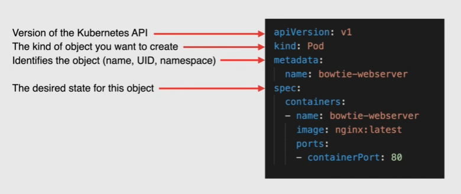
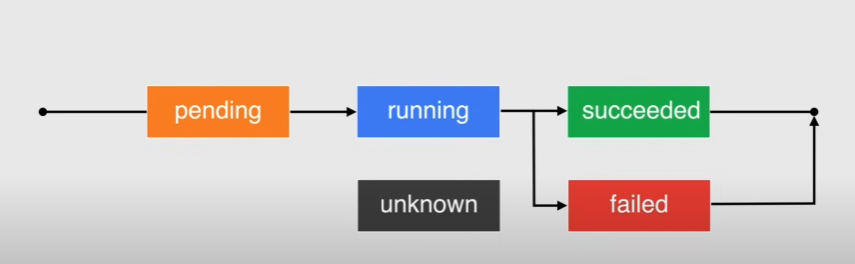

# Pods and objects

Kubernetes objects: persistent entities that represent the state of the cluster

An object is a *Record of intent*: when created kubernetes will work to ensure that object exists

Each object has some fields:

- Object Spec -> properties of the desired state
- Object Status -> current state
- uid -> unique across the cluster
- name
  - unique among objects of the same type

Manifest files used to define the Object Spec

- each configuration file can contain multiple manifests -> yaml(recommended) or json

## Pod

Smallest, basic deployable object in kubernetes

- represent a single instance of a running process
- contain 1 or multiple containers
  - each container is treated as a separate entity
  - share the pod's resources: networking and storage

Remains on the node until:

- process is complete
- is deleted
- is removed from node due to lack of resources
- the node fails

### Pod lifecycle

Unknown status: state of pod could not be determined due to a communication error

A pod is ephemeral:

- cannot heal
- if deleted it cannot be recovered

## Namespaces

Objective: multiple users that share the same kubernetes cluster

A namespace is a virtual cluster, isolated from other namespaces

- organize and secure resources

4 default namespaces:

- `default`
- `kube-system` -> objects created by kubernetes
- `kube-public` -> readable from all cluster
- `kube-node-lease`

### Labels

Key-value pair to organize resources, set under metadata

## Workloads

Objects that set deployment rules for pods

- define rules for applications scheduling, scaling and upgrade
- a deployment is a type of workload

### Deployments

**Replicas**: set of replicated pods managed by a controller, like deployments

- manage lifecycle of pods
  - makes sure that a certain number of pods is running at any time
- performs horizontal scaling -> change the # of pods
- replaces instances that failed with new ones
- use a pod template to specify how to generate a pod
- best used for stateless apps

### StatefulSets

- used for apps that require persistent storage

### DaemonSet

- ensures every node in the cluster runs a copy of a pod
  - useful for logs, monitoring

### JObs

- used to run a finite task until completion

### CronJobs

- run to completion on a schedule

### ConfigMaps

- configuration info for any workload to reference
  - environment variables, volume mounts...
- are NOT meant to store secrets data
  - use `secrets` instead
