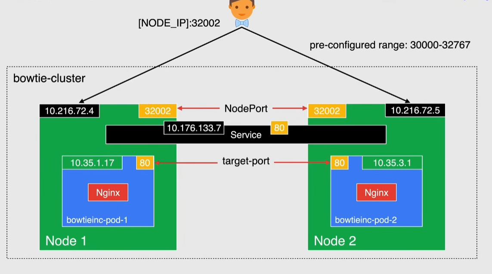
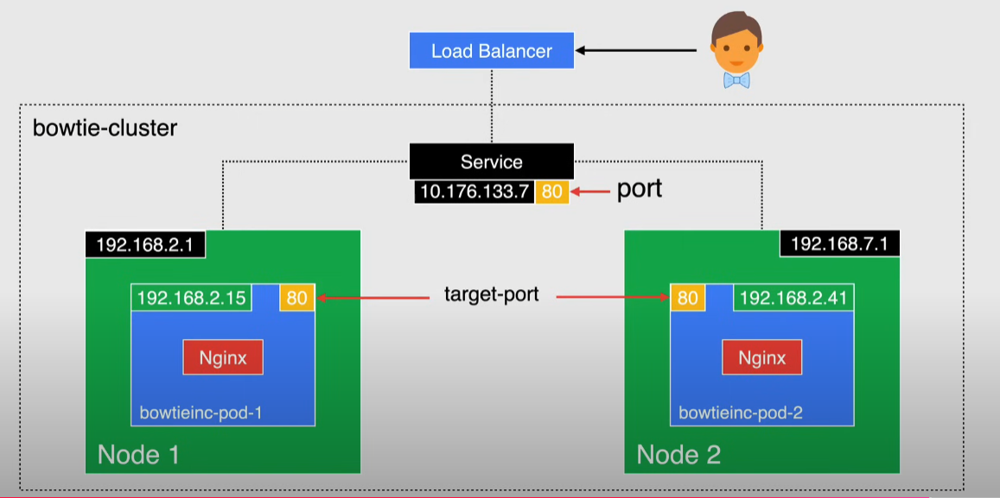
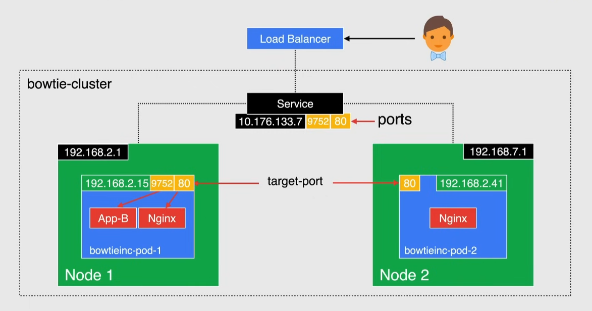

# Kubernetes services

Each pod has its own IP

- in a deployment, if a Pod is eliminated a new one will be created with the same IP

Service: logical set of pods that provides a single persistent IP and DNS name with which pods can be accessed

- it is NOT a process, but just an abstraction
- used to route external/internal traffic to pods
- used for load balancing and scaling

> [!NOTE]
> Services select pods matching their labels

## Service types

### ClusterIP

Default service type

- produces a service that other apps can access
- not exposed outside the cluster, but only inside with a **stable** IP
- called with the internal IP and the port specified in the `port` field of the manifest
  - request forwarded to one of the pods

### NodePort

- specify a NodePort value from the range 30000-32767 -> static port 
- the service is accessible(also externally) using `${nodeId}:${NodePort}`
- extension of ClusterIP since it also has a cluster IP
  - not very secure, since it opens every node to external internet

> [!NOTE]
> Nodes IP could change at any time

### LoadBalancer

Create an internal service and is connected to a Cloud Provider load balancer

- creates a static external IP and a DNS name that can be used to access the cluster
- extension of NodePort type
- default method to expose a service
  - but there is no filtering/routing

> [!IMPORTANT]
> for each service to expose you need to create a load balancer for which you have to pay

### Multi-port Services

Particular type of a normal service (ClusterIP, NodePort or LoadBalancer)

Expose multiple ports on a service

- name each port
  - name must be unique inside the same service

### ExternalName

Provides an internal alias for an external DNS name

- internal clients make a request using the internal name -> redirected to the external DNS name
- it is not a normal service, since it does not involve pods
  - it is just a simple CNAME redirection

> [!NOTE]
> Each service implicitly creates an internal DNS name to call the service

### Headless

Don't need either load balancing or a single IP -> create a headless service by specifying `None` as the service type in the manifest

Use cases:

- statefulSets -> name of pods is fixed