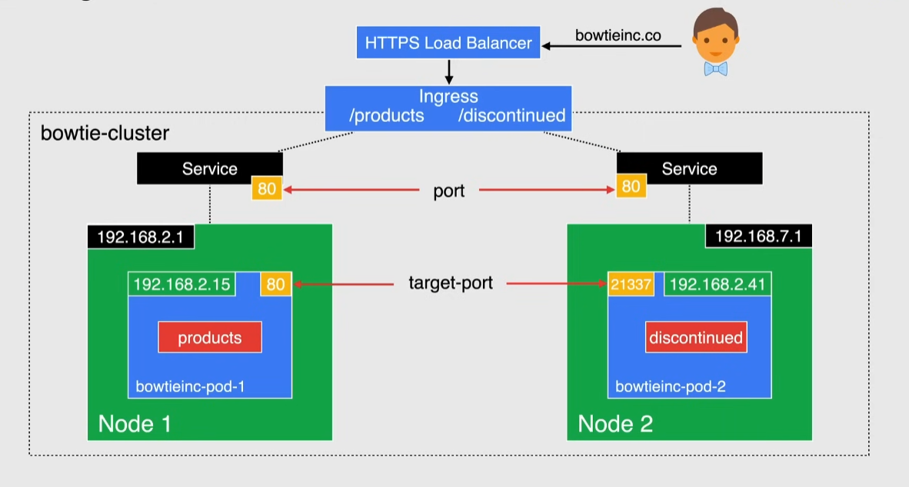
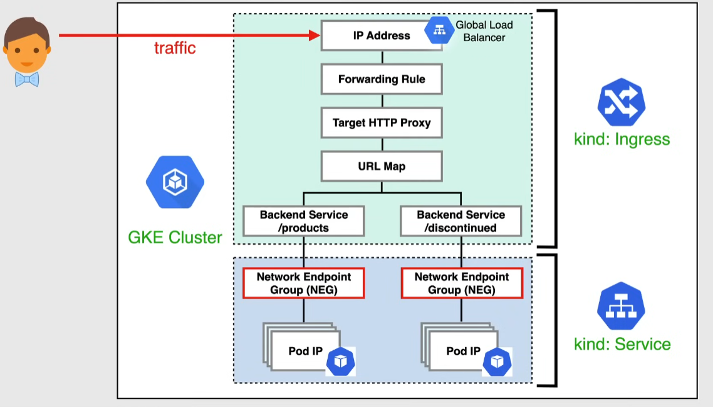

# GKE Ingress

Defines rules to route HTTP/HTTPS traffic to specific services

- associated to 1 or more services
- when created Google creates automatically an HTTP/HTTPS load balancer and configures it according to the ingress configuration
  - the load balancer is given a stable external IP that can be associated to a domain name
  - uses a single URL map that references 1 or more backend service(GKE service)
- cost effective to expose multiple services -> pay for just one load balancer

## Network Endpoint Group(NEG)

Specifies a group of backend endpoints/services

- useful for container-native load balancing -> each container is an endpoint
- used to track Pod endpoints dynamically
  - traffic is directly routed to Pods instead of traversing the VM IP and kube-proxy networking
- allows Compute Engine load balancers to communicate directly with Pods

## Health checks

If there are no specified health checks default and inferred parameters are used:

- these parameters should be explicitly defined by using a backend config `CRD`(Custom Resource Definition) if:
  - you are using Anthos Ingress Controller
  - more than 1 container in the pod
  - if you use a specific port for the check

## SSL certificates

3 ways to provide them to an HTTP load balancer

> [!NOTE]
> You can specify multiple certificates in an ingress manifest. The load balancer chooses the certificate if the common name in the certificate matches the hostname in the request

### Google-managed certificate

- provisioned, deployed, renewed by Google
- do NOT support wildcard domains

### Self-managed certificate

- self-created and shared with Google Cloud
- list the certificate in an ingress annotation for use

### Self-managed certificate as Secrets

- self-created and create a kubernetes secret to hold the certificate
- refer to the secret for use

