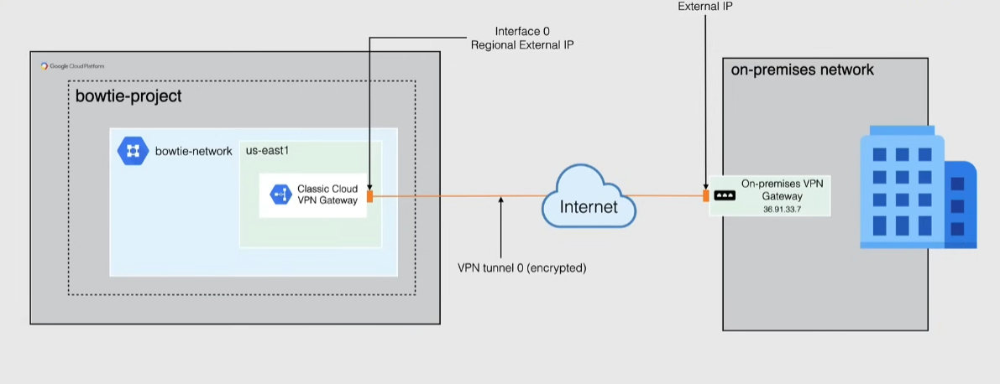
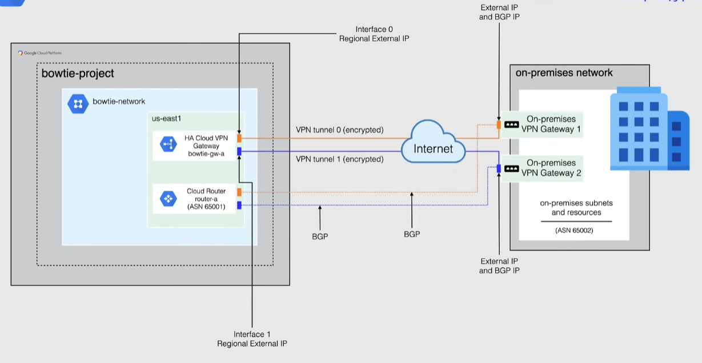

# Cloud VPN

Securely connects your peer network to your VPC through an IPsec VPN connection

- peer network -> on-premise network, another cloud provider network
- IPsec(Internet Security Protocol) encrypted tunnel over the public internet
  - set of protocols allowing transport of secure data over the internet
  - operates at network level
  - has some overhead
- traffic encrypted by one VPN gateway, decrypted by the other
- Regional Service
  - up to 3Gbps for ingress+egress
- Site to Site VPN only
  - **no site to client**
- can be used with Private Google Access for on-premises hosts
- supports `IKEv1` and `IKEv2` using Shared Secret
  - Internet Key Exchange -> establish a secure authenticated channel using the algorithm to generate a shared secret

## Types of Cloud VPN

### Classic VPN

- 99.9% SLA (3 9s SLA)
- deprecated since 2021
- static and dynamic routing
- 1 external IP for a single interface
  - offers no redundancy

### HA VPN

- 4 9s SLA
- dynamic routing only through BGP
- 2 external IPs to be configured for 2 interfaces
  - redundancy -> High Availability (HA)
- new default VPN

## When to use Cloud VPN

- A small business needs to connect their on-prem app server to GCP for secure nightly backups.
- public internet access needed
- when peering location is not available
- budget constrains
  - Cloud Interconnect is more expensive
- high speed/low latency not needed
- outgoing traffic(egress) from GCP