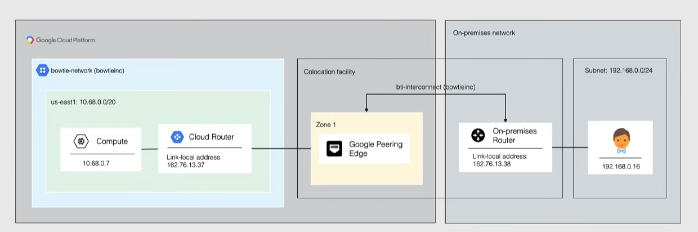
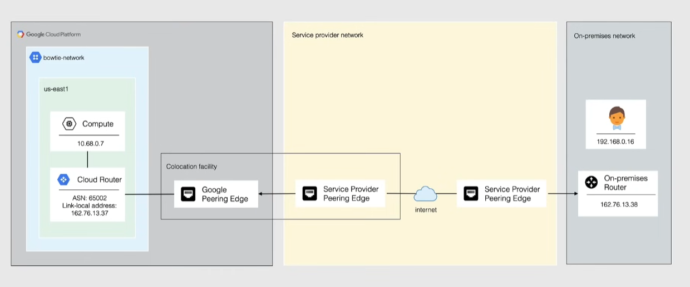

# Cloud Interconnect

Allows connectivity from on-premise to GC VPC network

- common in large organizations
- low-latency, highly-available
- provide internal IP address connection to VPC
  - on-premise hosts can access internal IPs and can take advantage of Private Google Access
- traffic does not traverse the public internet
  - it traverses a dedicated connection
  - not encrypted by default -> need to create self-managed VPN gateways
- high price

Use cases:

- A large enterprise connects its main data center to GCP to support a hybrid app platform, needing fast, predictable connectivity.
- prevent traffic to traverse the public internet
  - dedicated physical connection
- high-speed
  - travels through Google network backbone
- Private Google Access

## Cloud Interconnect types

### Dedicated Interconnect

- direct, physical connection between on-premise and VPC network
- transfer large amounts of data to and from google cloud
  - could be more cost-effective than purchasing more bandwidth from an internet provider
- on-premise network must physically meet google's network in a **colocation facility/interconnect connection location**
- connection capacity is delivered through 1 of these channels:
  - 8x10Gbps channels (total 80Gbps)
  - 2x100Gbps channels (total 200Gbps)
- for critical applications at least 2 interconnections in 2 locations are recommended

### Partner Interconnect

- connection through a service provider that provides a connection to Google
- useful if a colocation facility is out of reach
- 50Mbps to 50Gbps VLAN attachments
- use multiple service providers for higher availability

### Direct peering

- direct peering connection between an on-premise network and Google's edge network
  - direct path from on-premise to google network
- 100 locations in 33 countries
- save money and receive direct egress pricing
  - establishing a Direct Peering connection with google is **free**
  - just need to meet the technical requirements

### CDN Interconnect

- Content Delivery Network -> cache content on the network edge to deliver it faster
- enables certain CDN providers(Akamai, Cloudflare...) to establish an optimized CDN by using direct peering with Google
- reduced pricing on egress cost

## Exam tip

Cloud VPN = Encrypted + Internet + Quick Setup

Interconnect = Private link + High Performance + SLA
